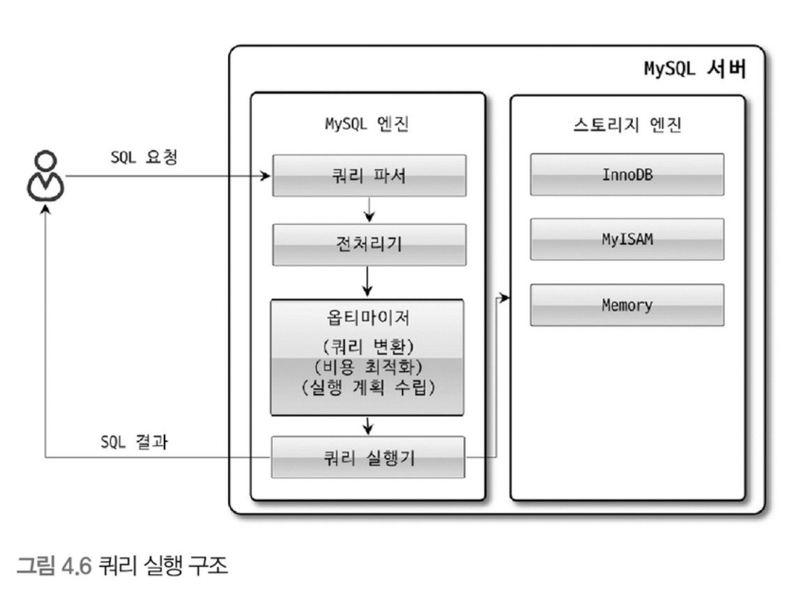
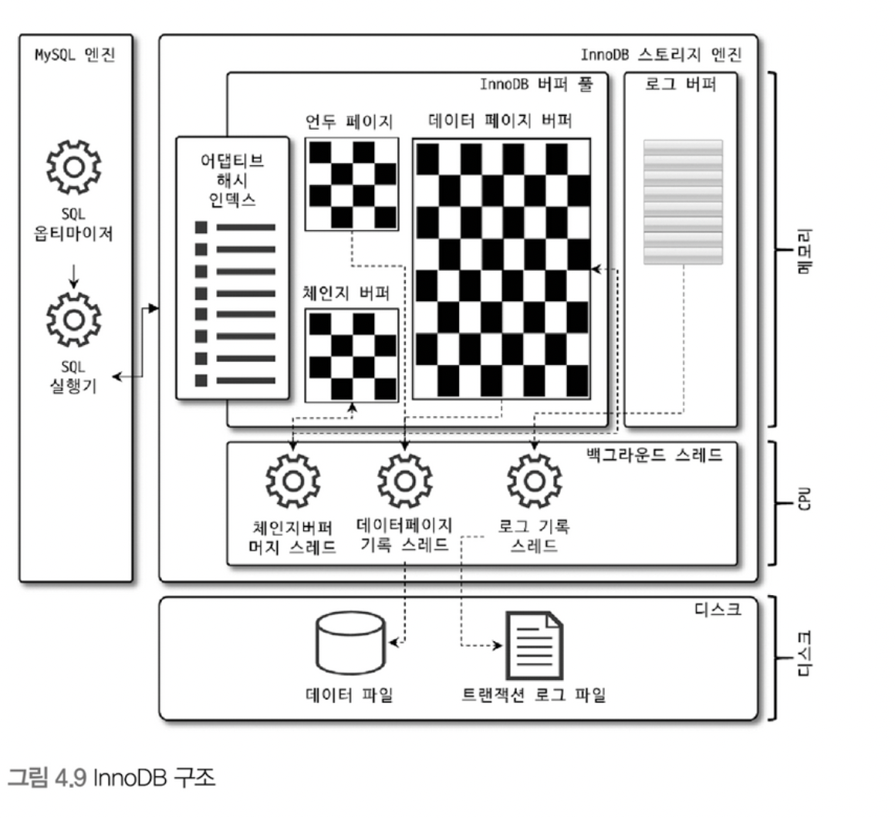
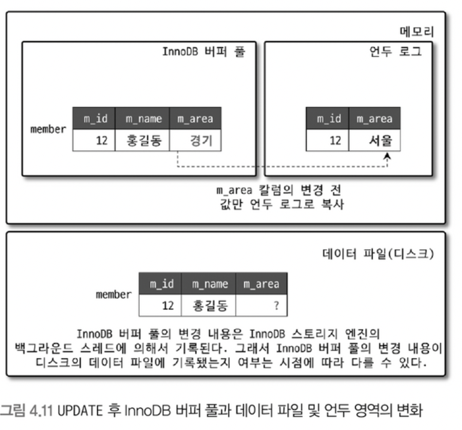

# chapter04. 아키텍쳐

## MySQL 엔진 아키텍처

### MySQL의 전체구조

#### MySQL 엔진

`사람의 머리 역할을 담당`

- 커넥션 헨들러: 클라이언트로부터의 접속 및 쿼리 요청을 처리
- SQL 파서 및 전처리기
- 옵티마이저: 쿼리의 최적화된 실행

#### 스토리지 엔진

`사람의 손발 역할을 담당`

- 실제 데이터를 디스크에 저장, 읽기를 담당
- MySQL 엔진은 하나지만, 스토리지 엔진은 필요에 따라 여러 가지를 바꿔 쓸 수 있음()
- 성능 향상을 위해 키 캐시(MyISAM 스토리지엔진)나 버퍼 풀(InnoDB 스토리지 엔진)과 같은 기능르 내장

#### 핸들러 API

- MySQL 엔지의 쿼리 실행기가 스토리지 엔진에 쓰기 및 읽기 요청을 위한 API

### MySQL 스레딩 구조

- MySQL 서버는 스레드 기반으로 작동

#### Foreground 스레드

- 사용자가 요청하는 쿼리 문장을 처리
- 스래드 캐시: 커넥션이 종료되면 스레드는 스래드 캐시로 돌아간다.
- 데이터 읽기 작업은 직접 처리
- 데이터 쓰기 작업은 캐시나 버퍼에 쓰는 작업은 직접 처리하지만, 디스크에 쓰는 작업은 백그라운드 스레드에 위임(InnoDB)

#### Background 스레드

- 로그 스레드(Log thread), 쓰기 쓰레드(Write thread) 중요
- 데이터 쓰기 작업은 버퍼링해서 일괄 처리하는 기능이 있다.(지연 쓰기, InnoDB)

### 메모리 할당 및 사용 구조

#### 글로벌 메모리 영역

- 서버 시작시 운영체제로 부터 할당 받는다.
- InnoDB 버퍼 풀
- MyISAM 키 캐시
- 바이너리 로그 버퍼
- 리두 로그 버퍼
- 테이블 캐시

#### 로컬(세션) 메모리 영역

- 클라이언트 스레드가 쿼리를 처리하는데 사용, 클라이언트 마다 공유 X
- 조인 버퍼
- 정렬 버퍼
- 네트워크 버퍼
- 리드 버퍼

### 플러그인

- 검색어 파서, 인증 등 플러그인으로 제공
- 스토리지 엔진 또한 플러그인 형태로 구현되어, 직접 구현하거나 교체 가능(핸들러 API 인터페이스만 만족하면 된다.)

### 컴포넌트

- MySQL 8.0부터 플러그인 아키텍쳐를 대체하기 위해 제공
- 플러그인의 단점
    - 플러그인은 오직 MySQL 서버와만 소통 가능하며, 플러그인끼리는 통신할 수 없음
    - 플러그인은 MySQL 서버의 변수나 함수를 직접 호출하기 때문에 안전하지 않음 (캡슐화 X)
    - 플러그인의 상호 의존 관계 설정이 불가능하여 초기화가 어려움

### 쿼리 실행기 구조

#### 쿼리 파서

- 쿼리 문장을 토큰(MySQL이 인식 하는 최소 단위의 어휘나 기호)으로 분리하여 트리 형태의 구조로 만든다.
- 기본 문법 오류 검증

#### 전처리기

- 쿼리 문장의 구조적인 문제점 확인
- 토큰을 실제 이름 및 개체등과 매핑해 객체의 존재 여부와 접근 권한등을 확인함

#### 옵티마이저

- 쿼리 문장의 실행 최적화

#### 실행 엔진

- 만들어진 계획대로 각 핸들러에게 요청해서 받은 결과를 또 다른 핸들러 요청의 입력으로 연결하는 역할

#### 핸들러

- 실행 엔진의 요청에 따라 디스크 저장 및 읽기 담당
- 스토리지 엔진을 일컫는다.

### 복제

- 2대 이상의 DBMS를 구성하여 데이터를 저장하는 방식
- 사용하기 위한 최소 구성은 Master / Slave 구성

### 쿼리 캐시

- SQL의 실행 결과를 메모리에 캐시
- 데이터의 변경이 읽어나면 캐시도 삭제해야하므로 성능 저하 -> MySQL 8.0에서는 제거된 기능

### 스레드 풀

- 사용자의 요청을 처리하는 스레드를 줄여서, 동시 처리 성능 극대화
- 스레드 그룹의 개수는 CPU 코어 개수만큼 만드는 것이 성능에 유리

### 트랜잭션 지원 메타데이터

- 메타 데이터(데이터 딕셔너리): 테이블의 구조 정보와 스토어드 프로그램 등의 정보
- 기존에는 파일로 저장(트랜잭션 지원 X)
- MySQL 8.0에서는 테이블로 관리(트랜잭션 지원 O)

## InnoDB 스토리지 엔진 아키텍쳐

### 프라이머리 키에 의한 클러스터링

- 프라이머리 키 값의 순서대로 디스크에 저장
- 세컨더리 인덱스는 프라이머리 키의 값을 논리적 주소로 사용

### 외래 키 지원

- InnoDB 스토리지 엔진에서만 지원(MyISAM, MEMORY X)

### MVCC(Multi Version ConCurrency Control)

- Multi Version: 하나의 레코드에 대해 여러 개의 버전이 동시에 관리
- `잠금을 사용하지 않는 일관된 읽기`를 제공
- 격리 수준에 따라 데이터의 조회 결과가 달라질 수 있다.
    - READ_UNCOMMITTED: 버퍼 풀의 데이터를 읽는다.(변경 후의 데이터)
    - READ_COMMITTED, 그 이상: 언두 영역의 데이터를 읽는다.(변경 전의 데이터)

### 잠금이 없는 일관된 읽기(Non-Locking Consistent Read)

- 읽기 작업은 다른 트랜잭션이 가지고 있는 잠금을 기다리지 않고, 읽기 작업이 가능
- 언두 로그의 데이터를 읽는다.

### 자동 데드락 감지

- 잠금 대기 목록 그래프(Wait-for List): 잠금이 교착 상태에 빠지지 않았는지 체크 하기 위함
- 데드락 감지 스레드
    - 잠금 대기 그래프로 검사하여 교착 상태에 빠진 트랜잭션 중 하나를 강제 종료
    - 언두 로그 레코드를 적게 가진 트랜잭션이 먼저 종료
    - 동시 처리 스레드가 많아 지거나 각 트랜잭션이 가진 잠금의 개수가 많아지면 데드락 감지 스레드가 느려진다.
    - 상황에 따라 ON/OFF 고려

### 자동화된 장애 복구

- MySQL 서버가 시작될 때 왼료되지 못한 트랜잭션이나 디스크의 일부만 기록된 데이터 페이지 등에 대한 복구 작업이 자동으로 진행
- `innodb_force_recovery` 시스템 변수 설정하여 데이터 파일이나 로그 파일의 손상 여부 검사 과정을 선별적으로 진행할 수 있다.
- 위 과정 실패시, 백업 + 바이너리 로그로 데이터 복구 가능
    - 바이너리 로그: 테이블 생성 작업과 테이블 데이터의 변경 등의 데이터베이스 변경을 기술하는 "이벤트"가 포함

### InnoDB 버퍼 풀

- 디스크의 데이터 파일이나 인덱스 정보를 메모리에 캐시해 두는 공간
- 쓰기 작업을 지연시켜 일괄 작업으로 처리 할 수 있게 해주는 버퍼 역할(랜덤한 디스크 작업의 횟수를 줄인다. == I/O작업으로 인한 컨텍스트 스위칭 횟수를 줄인다.)

#### 버퍼 풀의 크기 설정

- 메모리 공간의 50% 정도만 InnoDB 버퍼 풀로 설정하고, 조금씩 올려가면서 최적점을 찾는 것이 좋다.

#### 버퍼 풀의 구조

- 페이지 단위로 데이터를 읽고 쓴다.
- 페이지 조각을 관리하기 위해서 Free 리스트 자료구조, LRU 리스트, Flush 리스트라는 3가지 자료구조로 관리

- 프리 리스트
    - 버퍼 풀에서 실제 사용자 데이터로 채워지지 않은 비어있는 페이지들의 목록
    - 사용자 쿼리가 새롭게 디스크의 데이터 페이지를 읽어와야 하는 경우에 사용

- LRU 리스트
    - 디스크로부터 한번 읽어온 페이지를 버퍼풀의 메모리에 유지하여 디스크 읽기를 최소화
    - 오랫동안 사용자 쿼리가 접근하지 않은 페이지는 버퍼풀에서 제거

- 플러시 리스트
    - 디스크로 동기화되지 않는 데이터를 가진 데이터 페이지(더티 페이지)의 변경 시점 기준의 페이지 목록을 관리
    - 데이터가 변경이 되면 변경 내용을 리두로그에 기록, 변경된 데이터 페이지는 플러시 리스트에서 관리
    - 특정 시점에 체크 포인트를 발생시켜 디스크의 리두 로그와 데이터 페이지의 상태를 동기화

> **Note**  
> `플러시 리스트`: 변경된 데이터 페이지를 추적하고 디스크에 쓰기 위해 대기하는 데 사용  
> `리두 로그`: 트랜잭션의 변경 내역을 기록하여 데이터베이스 시스템의 내구성을 보장하는 데 사용  
> 두 가지 기능은 데이터베이스 시스템이 장애에 대응하여 데이터의 일관성과 내구성을 유지하는 데 필수적

#### 버퍼 풀과 리두 로그

- LSN(Log Sequence Number)
    - 리두 로그가 기록 될때마다 계속 증가하는 로그 포지션을 가짐.
    - 체크 포인터가 발생하면 체크 포인트 LSN 이전의 로그 엔트리는 디스크로 동기화되어야 한다.

#### 버퍼 풀 플러시

- 더티 페이지를 디스크에 동기화 시키는 과정
- 플러시 리스트(Flush_list) 플러시, LRU 리스트(LRU_list) 플러시라는 두가지 기능이 백그라운드로 실행

##### 플러시 리스트 플러시

- 플러시 리스트에서 오래전에 변경된 데이터 페이지 순서대로 디스크에 동기화하는 작업 수행
- 얼마나 많은 Dirty Page를 한 번에 기록하냐(버퍼링)가 성능에 영향을 미칠 수 있음
- Dirty Page를 디스크로 동기화하는 스레드를 클리너 스레드라고 하는데, 이는 변수 값을 통해 조정 가능함
- 기본적으로 전체 버퍼 풀이 가진 페이지의 90%까지 Dirty Page를 가질 수 있는데 이 또한 조정 가능함
- 하지만 Dirty Page의 수가 너무 많아지면 Disk I/O Burst가 발생할 수 있음. → 설정을 변경하여 일정 수준 이상의 더티 페이지가 발생하면 조금씩 기록하도록 할수도 있음
- Adaptive Flush 기능을 사용하면, InnoDB는 Redo 로그의 증가 속도를 분석하여 적절한 수준의 Dirty Page가 버퍼 풀에 유지될 수 있도록 디스크 쓰기를 실행한다

##### LRU 리스트 플러시

- LRU 리스트에서 사용 빈도가 낮은 데이터 페이지들을 제거해서 새로운 페이지들을 읽어올 공간을 만들어야 함
- LRU 리스트를 스캔하면서 Dirty Page는 동기화하고, Clean Page는 Free 리스트로 페이지를 옮김

#### 버퍼 풀 상태 백업 및 복구

- 서버 재시작 시 디스크의 데이터를 미리 버퍼 풀에 적재 (Warming Up) 함으로써 성능 향상
- 서버가 셧다운 되기 직전 버퍼 풀의 백업을 실행하고, 서버가 재시작 되면 자동으로 백업된 버퍼 풀의 상태를 복구 할 수 있는 기능 제공

#### 버퍼 풀의 적재 내용 확인

- 8.0 부터는 information_schema 데이터베이스에 innodb_cached_indexed 가 추가되어, `테이블의 인덱스별로 얼마나 버퍼 풀에 적재되어있는지` 확인할 수 있음.
- 이를 응용하여, 테이블 전체 페이지 중에서 대략 어느 정도 비율이 InnoDB 버퍼풀에 적재되어 있는지 확인할 수 있다.

### Double Write Buffer

- 디스크에 데이터를 기록할 때 데이터베이스는 일반적으로 한 번에 한 페이지씩 기록한다. 그러나 디스크에 데이터가 중간에 손상되거나 쓰기 작업이 중단될 경우 데이터베이스의 일관성이 깨질 수 있다.
- 더블라이트 버퍼를 도입하면, 데이터를 더블 라이트 버퍼에 먼저 기록한 다음에 디스크에 실제로 기록한다. 이렇게 하면 디스크에 한 번에 두 번 쓰기 때문에 하드웨어 문제로 인해 발생할 수 있는 데이터 손상을 줄일
  수 있다.

### 언두 로그

- `트랜잭션 보장`: 트랜잭션의 롤백 시 데이터의 복구를 위해 언두 로그를 이용한다.
- `격리 수준 보장`: 데이터 변경 도중에 다른 트랜잭션에서 해당 변경 레코드 조회 시, 격리 수준에 따라 언두 로그의 데이터를 조회 할 수 있다.

#### 언두 로그 레코드 모니터링

- 트랜잭션 관리의 문제로 언두 로그가 삭제되지 않고 계속 유지된다면...
- 빈번하게 변경된 레코드를 조회하는 쿼리가 실행되면 InnoDB 스토리지 엔진은 언두 로그의 이력을 모두 스캔하여 필요한 데이터를 찾는다 -> 성능 저하
- 평상시 언두 로그의 레코드 건수를 확인하여 언두 로그의 급증 여부를 모니터링하자.

#### 언두 테이블스페이스 관리

- 언두 테이블스페이스: 언두 로그가 저장되는 공간
- 기존(MySQL 8.0 이전)
    - 시스템 테이블스페이스로 저장 -> MySQL 서버가 초기화될때 생성되기 때문에 확장의 한계
    - 언두 로그 슬롯이 부족한 경우에는 트랜잭션을 시작 할 수 없는 문제 발생
- 이후(MySQL 8.0 이후)
    - 언두 로그는 항상 시스템 테이블스페이스 외부의 별도 로그 파일에 기록
    - 언두 테이블스페이스를 동적으로 추가 삭제 가능

### 체인지 버퍼

- 인덱스를 업데이트 경우
- 변경해야 할 인덱스 페이지가 버퍼풀에 없다면 디스크로부터 읽어와 업데이트해야 하므로 많은 I/O 작업이 발생
- I/O 작업을 즉시 실행햐지 않고 임시 공간(체인지 버퍼)에 저장해 두고 바로 사용자에게 결과를 반환하여 성능 향상
- 체인지 버퍼는 백그라운드 스레드인 체인지 버퍼 머지 스레드에 의해 디스크에 병합됨

### 리두 로그 및 로그 버퍼

- 리두 로그
    - 데이터의 변경 내용을 로그로 기록
    - 비정상 종료가 발생하면 리두 로그를 이용해 서버가 종료되기 직전의 상태로 복구
    - 트랜잭션이 커밋되면 즉시 디스크로 기록 되어야 함 -> 하지만 성능의 문제로 동기화 시기를 변경할 수 있는 옵션이 있다.
- 로그 버퍼
    - 리두 로그를 버퍼링하는 자료구조

#### 리두 로그 아카이빙

- 리두 로그 파일의 손실을 방지하기위한 아카이빙 기능 제공

#### 리두 로그 활성화 및 비활성화

- 데이터를 복구하거나 대용량 데이터를 한번에 적재하는 경우 리두 로그를 비활성화하여 데이터의 적재 시간을 단축할 수 있다.

### 어뎁티브 해시 인덱스

- InnoDB 스토리지 엔진에서 사용자가 자주 요청하는 데이터(페이지 단위)에 대해 자동으로 생성하는 인덱스
- <인덱스 키(B-Tree 인덱스의 고유 번호(Id), B-Tree 인덱스의 실제 값의 조합), 데이터 페이지 주소 값>의 쌍으로 관리
- 버퍼 풀에 올려진 데이터 페이지에 대해서만 어댑티브 해시 인덱스로 관리됨
    - 버퍼풀에서 없어지면 어댑티브 해시 인덱스에서도 없어짐
- 어댑티브 해시 인덱스의 도움을 많이 받을수록 삭제 또는 변경 작업은 더욱 치명적인 작업이 됨
    - 테이블 삭제시 어댑티브 해시 인덱스도 같이 삭제

### InnoDB와 MyISAM, MEMORY 스토리지 엔진 비교

- MySQL 8.0 버전 부터는 모든 기능을 InnoDB 스토리지 엔진으로 대체 가능

## MyISAM

### 키 캐시

- InnoDB의 버퍼 풀과 비슷한 역할
- 키 캐시는 인덱스만을 대상으로 작동
- 인덱스의 디스크 쓰기 작업에 대해서만 부분적으로 버퍼링 역할

### 운영체제의 캐시 및 버퍼

- 인덱스와 달리 테이블 데이터에 대해서는 버퍼링 기능 제공 X
- 운영 체제의 캐시 기능으로 약간의 성능 개선 가능 -> 운영 체제 캐시를 위한 메모리 공간을 충분히 마련해야 한다.

### 데이터 파일과 프라이머리 키(인덱스)의 구조

- 레코드는 INSERT 되는 순서대로 데이터 파일에 저장
- 레코드는 ROWID 라는 물리적 주소 값을 가진다.
- 프라이머리키와 세컨더리 인덱스는 모두 ROWID 값을 포인터로 가진다.

## MYSQL 로그 파일

### 에러 로그 파일

- MySQL 이 시작하는 과정과 관련된 정보성 및 에러 메세지
- 마지막으로 종료할 때 비정상적으로 종료된 경우 나타나는 InnoDB의 트랜잭션 복구 메세지
- 쿼리 처리 도중에 발생하는 문제에 대한 에러 메세지
- 비정상적으로 종료된 커넥션 메세지
- InnoDB의 모니터링 또는 상태 조회 명령의 결과 메세지
- MySQL 종료 메세지
- 제너럴 쿼리 로그 파일
- 슬로우 쿼리

### 슬로우 쿼리

- `long_query_time` 시스템 변수에 설정한 시간 이상의 시간이 소요되는 쿼리를 기록
- `Percona Toolkit 의 pt-query-digest 스크립트`를 이용하면 빈도나 처리 성능별로 통계 계산 할 수 있다.