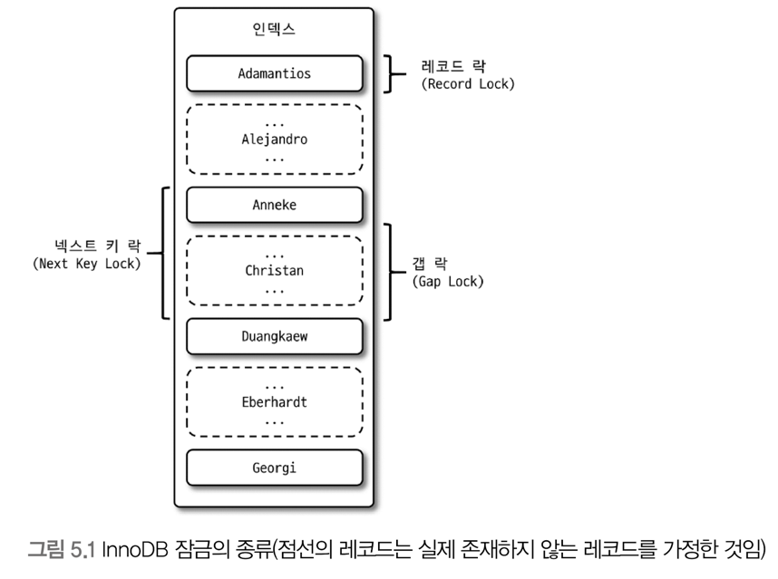
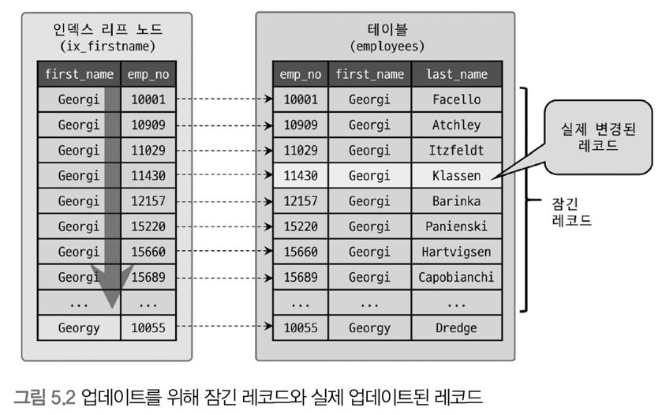
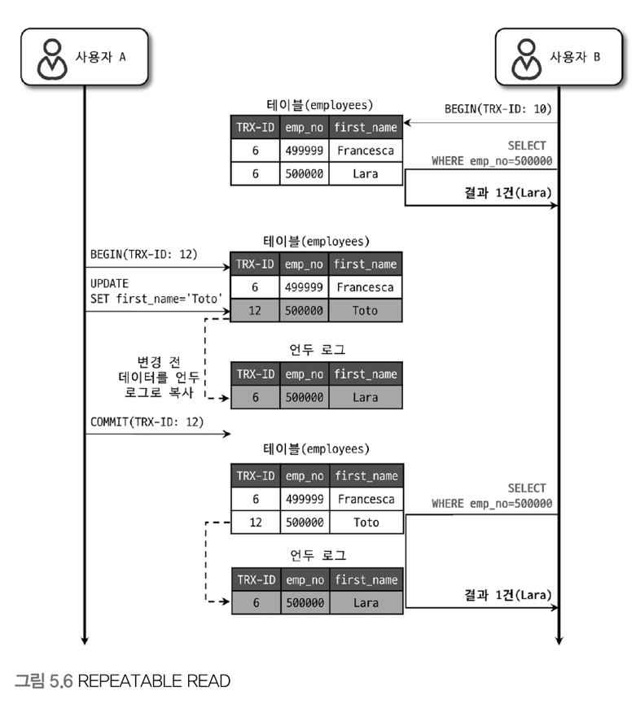
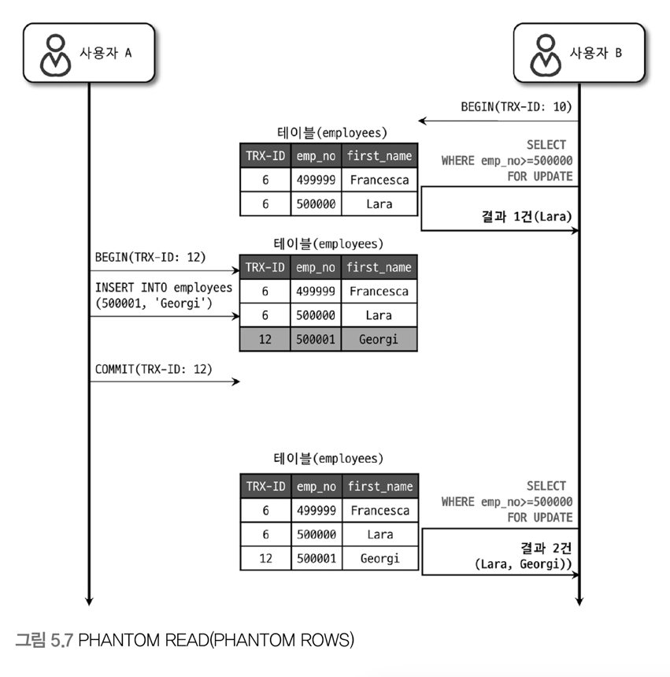

> ### 트랜잭션이란
> - 작업의 완전성을 보장해 주는 것
    >   - 논리적인 작업 셋을 모두 완벽하게 처리하거나 또는 처리하지 못할 경우에는 원상태로 복구하여 작업의 일부만 적용되는 현상이 발생하지 않도록 하는 것
> - 데이터의 정합성을 보장하기 위한 기능
>
> ### Lock 이란
> - 동시성을 제어하기 위한 기능
>
> ### 격리 수준이란
> - 하나의 트랜잭션 내에서, 또는 여러 트랜잭션 간의 작업 내용을 어떻게 공유하고 차단할 것인지를 결정하는 레벨


# 5.1 트랜잭션
## 5.1.1 MySQL에서의 트랜잭션
- 트랜잭션이란, 하나의 논리적인 작업 셋에 몇 개의 쿼리가 있든지 간에 관계없이 논리적인 작업 셋 자체가 100% 적용되거나 아무것도 적용되지 않아야 함을 보장하는 것
- 예시
    ```sql
    -- 조건: InnoDB 스토리지 엔진 사용, autocommit=ON
    -- 테이블에 3이라는 값이 이미 있다고 가정
    insert into table1 (pk) values (1), (2), (3);
    ```
    - 위 쿼리는 실패한다. 3이라는 값이 이미 있기 때문에 `ERROR 1062 (23000): Duplicate entry '3' for key 'PRIMARY'` 라는 에러가 발생한다.
    - InnoDB는 트랜잭션을 지원하기 때문에, 위 쿼리는 아무것도 적용되지 않는다. (insert 문장을 실행하기 전으로 복구)
        - 즉, 테이블에는 3이라는 값만 저장되어 있고, 위 쿼리는 완전히 실패하여 아무것도 적용되지 않는 것이다.
    - InnoDB는 트랜잭션을 지원하여 논리적인 작업셋의 완전한 성공 or 완전한 실패를 보장한다.


- MyISAM, Memory 엔진의 경우
    - MyISAM은 위 쿼리의 일부가 성공하여 테이블에 1과 2가 저장이 된다. (트랜잭션 지원 X)
    - 이를 일부만 적용되는 현상인 `Partial update`라고 한다.
        - 이는 데이터의 정합성을 맞추기 어렵게 만드는 요인이 된다.


## 5.1.2 주의사항
- DB 커넥션과 동일하게, 트랜잭션도 꼭 필요한 최소의 코드에만 적용하자
- 트랜잭션 범위를 최소화해야 함
- 예시
  ```text 
  1) 처리 시작 
    => 데이터베이스 커넥션 생성
    => 트랜잭션 시작 
  2) 사용자의 로그인 여부 확인 
  3) 사용자의 글쓰기 내용 오류 여부 확인
  ...대충 많은 작업들을 수행...
  5) 사용자의 입력 내용을 DB에 저장 
  ...대충 많은 작업들을 수행...
  8) 게시물 등록에 대한 알림 메일 발송 
  9) 알림 메일 발송 이력을 DB에 저장
    <= 트랜잭션 종료(COMMIT)
    <= 데이터베이스 커넥션 반납
  10) 처리 완료  
  ```
    - 실제로 DB에 저장하는 작업은 5번부터 시작함
        - 굳이 1~4번까지의 작업을 트랜잭션으로 묶을 필요가 없음
        - 필요하지 않은 작업도 트랜잭션에 포함시킬 경우, 불필요하게 커넥션 소유 시간이 길어짐
    - 8번 작업과 같이 외부 서버와 통신하는 작업은 DB 트랜잭션 내에서 제거하는 것이 좋음
        - 외부 서버와 통신할 수 없는 상황이 발생한다면 웹 서버 뿐만 아니라, DB까지 위험해지는 상황이 발생할 것
    - 트랜잭션 범위가 너무 크면, 별로 중요하지 않은 작업의 오류로 인해 모두가 롤백되어 버릴 수 있다.


- 예시 개선안
  ```text 
  1) 처리 시작 
  2) 사용자의 로그인 여부 확인 
  3) 사용자의 글쓰기 내용 오류 여부 확인
  4) 첨부로 업로드된 파일 확인 및 저장
    => 데이터베이스 커넥션 생성
    => 트랜잭션 시작 
  5) 사용자의 입력 내용을 DB에 저장
  6) 첨부 파일 정보를 DB에 저장  
    <= 트랜잭션 종료(COMMIT)  
  7) 저장된 내용 또는 기타 정보를 DB에서 조회 
  8) 게시물 등록에 대한 알림 메일 발송 
    => 트랜잭션 시작
  9) 알림 메일 발송 이력을 DB에 저장
    <= 트랜잭션 종료(COMMIT)
    <= 데이터베이스 커넥션 반납
  10) 처리 완료  
  ```
    - 트랜잭션을 단위별로 나누어 트랜잭션 범위를 최소화함
    - 조회 로직은 트랜잭션에서 제외함

- 요약
    - DB 커넥션과 트랜잭션 범위는 최소화 하자
    - 네트워크 작업이 있는 경우(외부 서버와 통신 등)는 반드시 트랜잭션에서 배제하자

---

--- 

## 5.2 MySQL 엔진의 잠금(Lock)
- MySQL의 Lock
    - 스토리지 엔진 레벨의 락
        - 스토리지 엔진 간 상호 영향을 미치지 않음
    - MySQL 엔진 레벨의 락
        - 모든 스토리지 엔진에 영향
        - 테이블락, 메타데이터 락, 네임드 락 기능 제공

### 5.2.1 글로벌 락
- MySQL에서 가장 범위가 큰 락
    - 한 세션이 글로벌 락 획득 시, 다른 세션에서 `select`를 제외한 대부분의 DDL 이나 DML 문장을 실행하는 경우 대기 상태로 전환됨
- 영향 범위: MySQL 서버 전체
    - 테이블이나 데이터베이스가 달라도 동일하게 영향을 미침
    - 글로벌락을 거는 동시에 서버에 존재하는 모든 테이블을 닫고 락을 검
        - 걸기 전에 테이블이나 레코드에 쓰기 락을 거는 SQL이 실행된 경우, 그 작업이 끝날때 까지 기다림
- InnoDB에서는 트랜잭션을 지원하므로, 데이터의 일관된 상태를 위해 모든 데이터 변경 작업을 멈출 필요가 없음
    - 가벼운 글로벌 락의 필요성 -> 백업락 도입
- 백업락
    - 백업 툴들의 안정적인 실행을 위해 도입된 락
    - 특정 세션이 백업 락을 획득한 경우
        - 불가능한 것
            - 모든 세션에서 테이블의 스키마나 사용자의 인증 관련 정보 변경 불가능
            - 데이터베이스 및 테이블 등, 모든 객체 생성 및 변경, 삭제
            - REPAIR TABLE, OPTIMIZE TABLE 명령
            - 사용자 관리 및 비밀번호 변경
        - 가능한 것
            - 일반적인 테이블의 데이터 변경
    - 정상적으로 복제는 실행되지만, 백업의 실패를 막기 위해 DDL 명령이 실행되면 복제를 일시중지함


### 5.2.2 테이블 락
- 개별 테이블 단위로 설정되는 락
- 명시적 또는 묵시적으로 획득 가능
    - 명시적 획득: `LOCK TABLES` 명령어 사용
        - `UNLOCK TABLES` 명령어로 명시적으로 해제
        - 필요한 상황이 아니면 애플리케이션에서 사용할 일이 거의 없음
    - 묵시적 획득: MyISAM, Memory 스토리지 엔진에서 데이터 변경 쿼리를 실행하는 경우 발생
        - MySQL 서버가 데이터 변경이 발생하는 동안 테이블 락을 설정하고 데이터를 변경한 후 즉시 락을 해제

- InnoDB
    - 스토리지 엔진 차원에서 레코드 기반의 락 제공
        - 단순 데이터 변경 쿼리로 인해 묵시적인 테이블 락이 발생하지 않음
    - 테이블 락을 사용하는 경우
        - 스키마를 변경하는 DDL 쿼리의 경우에만 영향을 미침 (DML 쿼리에서는 무시됨)


### 5.2.3 네임드 락
- 특정 문자열에 대해 락을 설정할 수 있는 기능
    - 대상이 테이블, 레코드, 혹은 `AUTO_INCREMENT`와 같은 데이터베이스 객체가 아니라는 것이 특징
    - 단순히 사용자가 지정한 문자열(String)에 대해 획득하고 반납하는 락임
- `GET_LOCK()`, `RELEASE_LOCK()` 함수를 사용하여 획득 및 해제
- 사용 예
    - DB 서버 1대에 5대의 웹 서버가 접속해서 서비스해야 하는 상황에서, 5대의 웹 서버가 어떤 정보에 대해 상호 동기화를 처리해야 할 때 사용하면 쉽게 해결 가능
    - 많은 레코드에 대해 복잡한 요건으로 레코드를 변경하는 트랜잭션에 유용하게 사용 가능
        - 배치 프로그램과 같이 한꺼번에 많은 레코드를 변경하는 쿼리를 사용하는 경우, 데드락의 원인이 되고는 함
        - 동일 데이터를 참조하거나 변경하는 프로그램끼리 분류해서 네임드 락을 걸고 쿼리를 실행하면 간단히 해결 가능


### 5.2.4 메타데이터 락
- 메타데이터: 데이터베이스, 테이블, 뷰, 프로시저, 함수 등의 정보를 저장하는 데이터
- 데이터베이스의 객체(테이블 뷰 등)의 이름이나 구조를 변경할 때 획득하는 락
- 테이블의 이름을 변경하는 경우 자동으로 획득 (`RENAME TABLE` 명령어 사용)
    - `RENAME TABLE`은 원본 이름과 변경될 이름 두 개 모두 한꺼번에 락을 설정함
- 사용 예
    - 배치 프로그램에서 실시간으로 테이블을 바꿔야 하는 요건이 발생하는 경우
      ```sql
      -- 배치 프로그램에서 별도의 임시 테이블(rank_new)에 서비스용 랭킹 데이터를 생성 
      -- 랭킹 배치가 완료되면 현재 서비스용 랭킹 테이블(rank)을 rank_backup으로 백업 
      -- 새로 만들어진 랭킹 테이블(rank_new)을 서비스용으로 대체하고자 하는 경우 
      rename table rank to rank_backup, rank_new to rank;  -- 모든 이름에 락을 걸어, 중간에 테이블이 존재하지 않는 상황을 방지
      ```
        - 두 개의 rename 작업을 한번에 실행할 경우 `Table not found 'rank`와 같은 상황을 발생시키지 않고 적용 가능
        - 아래와 같이 나눠서 실행할 경우, `rank` 테이블이 존재하지 않는다는 에러가 발생할 수 있음
          ```sql
          rename table rank to rank_backup;
          -- 중간에 테이블이 존재하지 않는 순간이 있음 (rank가 rank_backup으로 변경된 후)
          rename table rank_new to rank;
          ```

- 서비스 환경에서 무턱대고 DDL을 실행하면 안됨
    - 버퍼 크기, 언두 로그 등 고려해야 할 요소가 너무 많음
    - 단일 스레드로 작동하여, 상당히 많은 시간이 소모됨
    - 아래와 같은 순서로 작업할 것을 추천
        1. 신규 테이블 생성
        2. 기존 테이블의 레코드들을 신규 테이블로 범위 별로 나눠서 복사
        3. 트랜잭션을 autocommit으로 실행 (Q.각각의 작업을 단일 트랜잭션으로 하려고 그러나..? 오토커밋이어야 하는 이유?)
        4. 기존 테이블과 신규 테이블에 대해 쓰기락 획득
        5. 남은 데이터를 전부 복사
        6. 복사가 완료되면 기존 테이블의 이름을 old 등으로 변경하고, 신규 테이블을 기존 테이블의 이름으로 변경
        7. 완료 후 old 테이블 삭제

---

---

## 5.3 InnoDB 스토리지 엔진 락
- 레코드 기반의 락 방식 탑재
    - 뛰어난 동시성 처리 제공
- InnoDB의 트랜잭션과 락, 락 대기중인 트랜잭션 목록 조회 방법
    - `information_shema` 스키마의 `INNODB_TRX`, `INNODB_LOCKS`, `INNODB_LOCK_WAITS` 테이블을 사용
    - `Performance Schema` 스키마를 이용한 세마포어에 대한 모니터링 방법도 있음

### 5.3.1 InnoDB 스토리지 엔진의 락
- InnoDB 스토리지 엔진의 락은 레코드 기반의 락 방식을 사용
    - 레코드 기반의 락: 특정 레코드에 대해 락을 설정하는 방식
    - 락 정보가 상당히 작은 공간으로 관리 됨
        - 레코드 락이 페이지 락 또는 테이블 락으로 레벨업되는 경우(락 에스컬레이션)는 없다고 함


#### 5.3.1.1 레코드 락
- 레코드 자체만을 잠그는 락
    - InnoDB는 **레코드 자체가 아닌, 인덱스의 레코드를 잠금**
    - 인덱스가 하나도 없는 테이블이라도, 내부적으로 자동 생성된 클러스터 인덱스를 이용해 락 설정
- 보조 인덱스를 이용한 변경 작업은 넥스트키 락 or 갭 락 사용
    - PK or 유니크 인덱스에 의한 변경 작업에서는 갭(Gap)에 대해서는 잠그지 않고, 레코드 자체에만 락을 검

#### 5.3.1.2 갭 락
- 레코드 자체가 아닌, 레코드와 바로 인접한 레코드 사이의 간격만을 잠그는 락
- 레코드와 레코드 사이의 간격에 새로운 레코드가 생성(`insert`)되는 것을 제어함
- 넥스트키 락의 일부로 자주 사용됨

#### 5.3.1.3 넥스트키 락
- 레코드 락 + 갭 락
- 바이너리 로그 ([복제 구성을 위한 바이너리 로깅 형식](https://omty.tistory.com/63))
    - STATEMENT format
        - 실행되는 쿼리 자체를 로그로 기록
        - 그렇기 때문에, 로그를 이용하여 복구할 때 `REPEATABLE READ` 격리 수준을 사용해야만 데이터 불일치 현상이 발생하지 않을 것임
            - 동일 트랜잭션 내에서는 같은 결과가 나오는 것을 보장하므로
        - 비 확정적으로 처리되는 쿼리문은 사용 불가
            - ex: uuid() 함수 -> 데이터 값이 달라질 수 있음
    - ROW format
        - 행 단위 변경 내용을 로그로 기록
            - 데이터를 로깅함
        - STATEMENT format의 단점을 많이 해결해 줌
            - 변경된 데이터 자체가 바로 적용되기 때문에 Statement 방식보다 더 적은 lock 사용
            - 모든 트랜잭션 격리수준에서 사용 가능
            - 변경된 데이터가 많을수록 바이너리 로그 파일 크기가 커짐
            - DDL문은 STATEMENT 방식으로 로깅
- 넥스트키 락의 주 목적
    - 바이너리 로그를 이용한 복제 구성에서 발생하는 데이터 불일치 현상을 방지하기 위함
    - 즉, 바이너리 로그에 기록되는 쿼리가(STATEMENT format) 레플리카 서버에서 실행될 때, 소스 서버에서 만들어낸 결과와 동일한 결과를 만들어내도록 보장하는 것이 주 목적
- 넥스트키 락, 갭 락으로 인해 데드락이 발생하거나 다른 트랜잭션을 기다리게 만드는 일이 자주 발생됨
    - 가능하다면 바이너리 로그 포맷을 ROW 형태로 바꿔서 넥스트 키 락이나 갭 락을 줄이는 것이 좋음
    - **MySQL 8.0 부터는 ROW 포맷이 기본**

#### 5.3.1.4 자동 증가 락
- 자동 증가하는 숫자 값을 추출하기 위해 `AUTO_INCREMENT`라는 컬럼 속성을 제공
    - `AUTO_INCREMENT` 컬럼이 사용된 테이블에 동시에 여러 레코드가 `INSERT`되는 경우, 각 레코드는 중복되지 않고 저장된 순서대로 증가하는 일련번호 값을 가져야 함
    - 이를 위해 InnoDB가 내부적으로 제공하는 락이 자동 증가 락임
- 테이블 수준의 락
    - 테이블에 단 한개만 존재
    - 두 개의 `INSERT` 쿼리가 동시에 실행되면, 하나의 쿼리가 `AUTO_INCREMENT` 락을 걸고 나머지 쿼리는 해당 락을 기다려야 함
- 새로운 레코드를 저장하는 쿼리에서만 필요
- 트랜잭션과 관계 없음
    - `INSERT`, `REPLACE` 문장에서 `AUTO_INCREMENT` 값을 가져오는 순간만 락이 걸렸다가 즉시 해제
    - 아주 짧은 시간만 걸리기 때문에 대부분 문제가 되지 않음
- 명시적 획득/해제 불가능
- `innodb_autoinc_lock_mode`
    - `0`
        - 모든 `INSERT`문장에 자동 증가 락 사용
    - `1(consecutive mode)`
        - 한건 또는 여러 건의 레코드를 `INSERT`하는 SQL 중에서, `INSERT`되는 레코드 건수를 정확히 예층할 수 있을 때는 락을 사용하지 않음
        - 훨씬 가볍고 빠른 래치(뮤텍스)를 이용해서 처리 -> 자동 증가 락보다 더 짧은 시간동안 락을 걸고, 자동 증가 락을 가져오는 즉시 락 해제
        - 예측 불가능한 경우에는 자동 증가 락을 사용
        - 대량 `INSERT`가 수행될 때
            - 한번에 여러 개의 자동 증가 값을 할당받아서 `INSERT` 레코드에 사용
            - 남아서 사용되지 못할 경우 폐기 -> 누락된 값이 발생되어 연속되지 않을 수 있음
    - `2(interleaved mode)`
        - MySQL 8.0 부터의 기본 값
        - 자동 증가 락을 절대 걸지 않고, **경량화된 래치(뮤텍스)를 사용**
        - 하나의 `INSERT`문장으로 레코드를 저장한다고 하더라도, **연속된 자동 증가 값을 보장하지 않음**
        - 대량의 `INSERT`문이 실행되는 중에도, 다른 커넥션에서 `INSERT`를 수행할 수 있어 **동시 처리 성능이 높음**
        - 해당 모드에서는 자동 증가 기능이 **유니크한 값이 생성된다는 점만 보장하고, 연속된 값을 보장하지는 않음**
        - `STATEMET` 포맷의 바이너리 로그를 사용하는 경우, 소스 서버와 레플리카 서버의 자동 증가 값이 달라질 수 있으므로 주의할 것


### 5.3.2 인덱스와 락
- InnoDB의 락과 인덱스는 상당히 중요한 연관관계가 있음
- 레코드 락은 **레코드가 아닌, 인덱스를 잠그는 방식으로 처리됨**
    - "변경해야 할 레코드를 찾기 위해 검색한 인덱스의 레코드"를 모두 락을 걸어야 함

#### 예제를 통해 알아보기
```mysql
-- first_name 컬럼에 인덱스가 걸려있는 상황 
select count(*) from employees where first_name='Georgi';  -- 253개의 data
select count(*) from employees where first_name='Georgi' and last_name='Klassen';  -- 1개의 data 
update employees set hire_date=NOW() where first_name='Georgi' and last_name='Klassen';  -- 몇 개의 레코드에 락이 걸릴까?
```


- 인덱스를 이용할 수 있는 조건 -> `first_name='Georgi'`
    - `last_name`은 인덱스가 없음
    - 결국, `first_name='Georgi'`인 253개의 레코드에 모두 락이 걸림
    - 즉, `update` 문장을 위해서는 **적절한 인덱스가 준비돼있어야 한다!**
- 인덱스가 하나도 없다면..? 😨
    - 테이블 풀 스캔 수행 -> `update`작업 수행 -> 테이블에 있는 모든 레코드를 잠그게 됨
> ### 결론
> - InnoDB에서 인덱스 설계는 매우매우매우 중요하다!!


### 5.3.3 레코드 수준의 락 확인 및 해제
- 테이블 락은 대상이 테이블 자체
    - 문제가 발생해도 원인을 빠르게 파악하고 해결하기 쉬움
- 레코드 수준 락
    - 테이블의 레코드에 각각 락이 걸림
    - 레코드가 자주 사용되지 않을 경우 오랜시간 동안 락이 걸려있어도 잘 발견되지 않음
- 레코드 락에 대한 메타 정보를 확인하여 조회 가능
    - MySQL 8.0~
        - `performance_schema` 스키마의 `data_locks`, `data_lock_waits` 테이블을 이용하여 확인


---

---

## 5.4 MySQL 격리 수준
- 트랜잭션 격리 수준(isolation level)
    - 여러 트랜잭션이 동시에 처리될 때, 특정 트랜잭션이 다른 트랜잭션에서 변경하거나 조회하는 데이터를 볼 수 있게 허용할지 말지를 결정하는 것
- 트랜잭션 격리 수준의 종류 (아래로 갈수록 `격리 수준↑`, `동시성 처리 성능↓`)
    - `READ UNCOMMITTED`
    - `READ COMMITTED`
    - `REPEATABLE READ`
    - `SERIALIZABLE`


부정합 문제

|                  | DIRTY READ | NON-REPEATABLE READ | PHANTOM READ  |
|------------------|------------|---------------------|---------------|
| READ UNCOMMITTED | O          | O                   | O             |
| READ COMMITTED   | X          | O                   | O             |
| REPEATABLE READ  | X          | X                   | O(InnoDB는 없음) |
| SERIALIZABLE     | X          | X                   | X             |


### 5.4.1 READ UNCOMMITTED

- 트랜잭션에서 변경한 내용이 COMMIT이나 ROLLBACK 여부와 상관없이 다른 트랜잭션에서 조회 가능
- 위 예제에서 발생할 수 있는 문제
    - 사용자 A가 롤백을 한다고 하더라도, 여전히 사용자 B는 "Lara"가 정상적인 사원이라고 생각하고 계속 처리할 수 있음
    - 이를 `DIRTY READ`라고 함
- `DIRTY READ`는 데이터가 나타났다 사라졌다 하는 현상을 초래
- READ UNCOMMITED는 정합성에 문제가 많은 격리 수준 (격리를 안한다고 봐도 무방)


### 5.4.2 READ COMMITTED

- 트랜잭션에서 변경한 내용이 COMMIT된 경우에만 다른 트랜잭션에서 조회 가능
- `DIRTY READ`는 발생하지 않음
- 예제 설명
    - 사용자 A가 "Lara" -> "Toto"로 변경
    - 새로운 값인 "Toto"는 테이블에 즉시 기록
        - 이전 값인 "Lara"는 언두 로그에 기록
    - 사용자 B가 `emp_no=500000`인 사원을 조회 요청
    - 언두 로그에 기록된 데이터인 "Lara"를 반환
    - 사용자 A가 커밋
    - 이후 요청에 대해서는 "Toto"를 반환
- `NON-REPEATABLE READ` 부정합 발생
    - 
    - 사용자 B가 트랜잭션을 시작하고 "Toto" 사용자 조회
    - 결과가 없음
    - 사용자 B의 트랜잭션이 끝나기 전에, 사용자 A가 "Lara"를 "Toto"로 변경하고 커밋
    - 사용자 B가 다시 "Toto" 사용자 조회
    - `READ COMMITTED`는 커밋된 결과를 반환하므로, 결과가 있음
    - 사용자 B는 같은 트랜잭션 내에서 조회한 결과가 다름 -> `NON-REPEATABLE READ` 부정합 발생
- 위와 같은 부정합 문제는...
    - 하나의 트랜잭션에서 동일한 데이터를 여러번 읽고 변경하는 작업이 **금전적인 처리와 연결되면 문제가 될 수도 있음**


### 5.4.3 REPEATABLE READ

- InnoDB 스토리지 엔진의 기본 격리 수준
- `NON-REPEATABLE READ`는 발생하지 않음
- MVCC(Multi Version Concurrency Control)
    - 변경 전 레코드를 Undo 공간에 백업해두고 실제 레코드 값을 변경
    - 이를 이용해 동일 트랜잭션 내에서는 동일한 결과를 보여줄 수 있게 보장함
- `READ COMMITED`와의 차이
    - 언두 영역에 백업된 레코드의 여러 버전 가운데, 몇 번째 이전 버전까지 찾아 들어가야 하느냐가 다름
- InnoDB의 특징
    - 모든 InnoDB의 트랜잭션은 순차적으로 증가하는 고유한 트랜잭션 번호를 가짐
    - 언두 영역에 백업된 모든 레코드에는 **변경을 발생시킨 트랜잭션 번호가 포함돼 있음**
    - 언두 영역의 백업 데이터는 InnoDB 엔진이 불필요하다고 판단하는 시점에 주기적으로 삭제
    - `REPEATABLE READ`격리 수준에서는 MVCC를 보장하기 위해, 실행 중인 트랜잭션 가운데 가장 오래된 트랜잭션 번호보다 트랜잭션 번호가 앞선 언두 영역의 데이터는 삭제할 수 없음
        - 가장 오래된 트랜잭션 번호 이전의 트랜잭션에 의해 변경된 모든 언두 데이터가 필요한 것은 아님
        - 따라서, **특정 트랜잭션 번호의 구간 내에서 백업된 언두 데이터가 모두 보존되어야 함**
- 예제 설명
    - 사용자 B가 `emp_no=500000`인 사원을 조회 (TRX-ID : 10)
    - "Lara" 반환 (TRX-ID : 6)
    - 사용자 A가 "Lara" -> "Toto"로 변경 (TRX-ID : 12)
    - 새로운 값인 "Toto"는 테이블에 즉시 기록 (TRX-ID : 12)
        - 이전 값인 "Lara"는 언두 로그에 기록 (TRX-ID : 6)
    - 사용자 A가 커밋 (TRX-ID : 12)
    - 사용자 B가 다시 `emp_no=500000`인 사원을 조회 (TRX-ID : 10)
    - **TRX-ID가 10보다 작은 데이터**인 "Lara" 반환 (TRX-ID : 6)
- `PHANTOM READ` 부정합 발생
    - 
    - 사용자 B가 `FOR UPDATE`를 이용하여 `emp_no>=500000`인 사원을 조회 (TRX-ID : 10)
    - "Lara" 1건만 반환 (TRX-ID : 6)
    - 사용자 A가 "Georgi(`emp_no=500001`)"를 `INSERT`하고 커밋 (TRX-ID : 12)
    - 사용자 B가 `FOR UPDATE`를 이용하여 `emp_no>=500000`인 사원을 조회 (TRX-ID : 10)
    - "Lara(TRX-ID : 6)", "Georgi(TRX-ID : 12)" 2건이 반환됨
    - 사용자 B는 같은 트랜잭션 내에서 같은 조회 쿼리를 사용했음에도 불구하고 레코드가 보였다 안보였다 하는 현상을 겪게 됨 (`PHANTOM READ`)
- 위 부정합이 발생하는 이유
    - `SELECT ... FOR UPDATE`는 `SELECT`하는 레코드에 쓰기 락을 검
        - **언두 레코드에는 락을 걸 수 없음**
    - `SELECT ... FOR UPDATE`와 같은 명령으로 조회되는 레코드는 **언두 영역의 변경 전 데이터를 가져오는 것이 아닌, 현재 레코드의 값을 가져옴**
    - 즉, TRX-ID가 현재 트랜잭션보다 작은 레코드는 언두 영역에 백업된 데이터가 아닌, 현재 레코드의 값을 그대로 읽어오게 되어 발생한다
- InnoDB는 팬텀 리드가 발생하지 않는다던데...
    - 갭 락과 넥스트키 락 덕분에 발생하지 않는다고 함
        - 테이블을 검색할 때 발견된(조회된) 레코드에 대해 레코드와 레코드 앞의 갭에 대해 락을 건다.
        - 따라서 조회된 레코드를 수정할 수 없고, 레코드 앞의 갭에 락을 걸었기 때문에 레코드 앞에 데이터가 새로 추가될 수 없다.
        - 또한 검색된 마지막 레코드 뒤에 갭락을 걸어서, 마지막 레코드의 다음 데이터를 추가할 수 없도록 락을 건다.
    - 참고 자료
        - [공식 문서](https://dev.mysql.com/doc/refman/8.0/en/innodb-next-key-locking.html)
        - [MySQL에서 Phantom Read 처리를 하지 않을 경우 SELECT 성능](https://medium.com/sjk5766/mysql%EC%97%90%EC%84%9C-phantom-read-%EC%B2%98%EB%A6%AC%EB%A5%BC-%ED%95%98%EC%A7%80-%EC%95%8A%EC%9D%84-%EA%B2%BD%EC%9A%B0-select-%EC%84%B1%EB%8A%A5-b207c5ca3c87)
        - [트랜잭션의 격리 수준(Isolation Level)에 대해 쉽고 완벽하게 이해하기](https://mangkyu.tistory.com/299)

### 5.4.4 SERIALIZABLE
- 가장 단순하고 가장 엄격한 격리 수준
- 동시 처리 성능이 가장 낮음
- 읽기 작업도 쓰기 작업과 동일하게 락을 걸어서 처리하기 때문에, 읽던 쓰던 간에 한 트랜잭션만 작업을 수행할 수있음


