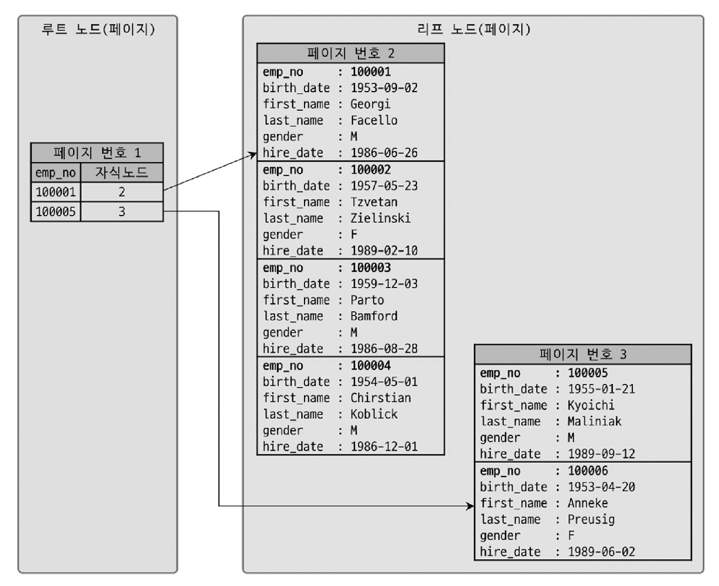

# Introduction
- 인덱스는 DB 쿼리 성능에 있어서 매우 중요한 역할을 함
    - 쿼리 튜닝의 기본
- 각 인덱스의 특성과 차이는 상당히 중요함

# 8.1 디스크 읽기 방식
- CPU, 메모리와 같이 전기적 특성을 띤 장치 성능은 매우 빠른 속도로 발전함
    - 디스크와 같은 기계식 장치 성능은 제한적으로 발전함
    - SSD가 나왔지만, 여전히 가장 느림
- DB 성능 튜닝은 디스크 I/O를 어떻게 줄이느냐가 관건일 때가 많음


## 8.1.1 하드 디스크 드라이브(HDD)와 솔리드 스테이트 드라이브(SSD)
### HDD
- 기계식 장치
- DB 서버에서는 디스크 장치가 병목이 됨

### SSD
- 기계식 HDD를 대체하기 위해 등장한 전자식 저장 매체
- SATA, SAS와 같은 인터페이스 지원 → 내장 디스크, DAS, SAN에 그대로 사용 가능
- HDD의 데이터 저장용 플래터(원판) 제거 → 플래시 메모리 장착
    - 디스크 원판을 기계적으로 회전시킬 필요 X → 빠른 데이터 입출력
- D-ram보다는 느리지만 HDD보다는 훨씬 빠름
- DBMS 서버에는 대부분 SSD를 채택
- 순차 I/O
    - 디스크 헤더를 움직이지 않고 한 번에 많은 데이터를 읽는 작업
    - HDD보다 조금 빠르거나 거의 비슷한 성능
- 랜덤 I/O
    - HDD보다 훨씬 빠름
    - DB 서버에서는 순차 I/O보다 랜덤 I/O로 작은 데이터를 읽고 쓰는 작업이 대부분임
        - SSD는 DB 서버에 최적화된 디스크 장치임

## 8.1.2 랜덤 I/O와 순차 I/O

- 순차 I/O
    - 3개의 페이지를 디스크에 기록하기 위해 1회의 시스템 콜 요청
    - 디스크에 기록해야 할 위치를 찾기 위해 디스크의 헤드를 1회 움직임
- 랜덤 I/O
    - 3개의 페이지를 디스크에 기록하기 위해 3회의 시스템 콜 요청
    - 디스크에 기록해야 할 위치를 찾기 위해 디스크의 헤드를 3회 움직임
- 즉, 디스크의 성능은 디스크 헤더의 **위치 이동 없이, 얼마나 많은 데이터를 한 번에 기록하느냐**에 의해 결정됨
    - 여러 번 read/write를 요청하는 랜덤 I/O 작업이 부하가 더 큼
    - DB 서버에서는 랜덤 I/O가 많이 발생함

### RAID controller
- 저장된 데이터에 대한 액세스 속도를 높여 컴퓨팅 성능 향상에 도움을 줄 수 있는 컨트롤러
    - [참고 자료](https://www.techtarget.com/searchstorage/definition/RAID-controller)
- 기업용 DB 서버에는 일반적으로 캐시 메모리가 장착된 RAID 컨트롤러가 사용됨
    - 캐시 메모리: 빈번한 파일 동기화 작업이 호출되는 순차 I/O를 효율적으로 처리될 수 있게 변환하는 역할 수행
    - 순차 I/O도 파일 동기화 작업이 빈번한 경우, 비효율적인 형태로 처리될 때가 많음 → 이럴 때 RAID controller가 큰 역할을 함

### 쿼리 튜닝
- 랜덤 I/O 자체를 줄여주는 것이 목적
- 랜덤 I/O를 줄인다 == 쿼리를 처리하는 데 꼭 필요한 데이터만 읽도록 개선한다

### 인덱스 레인지 스캔 vs 풀 테이블 스캔
- 인덱스 레인지 스캔
    - 데이터를 읽기 위해 랜덤 I/O 사용
- 풀 테이블 스캔
    - 순차 I/O 사용
    - 큰 테이블의 레코드 대부분을 읽는 작업이나, 테이블에 row가 적은 경우에는 풀 테이블 스캔을 사용하도록 유도할 때가 있음
        - 순차 I/O가 랜덤 I/O보다 훨씬 빨리 많은 레코드를 읽어올 수 있기 때문
        - 이런 형태는 OLTP(On-Line Transaction Processing) 성격의 웹 서비스보다는 데이터 웨어하우스나 통계 작업에서 자주 사용됨

---

---

# 8.2 인덱스란?
- 비유
    - 책 맨 끝의 색인 or 찾아보기 → 인덱스
    - 책의 내용 → 데이터 파일
- 최대한 빨리 찾을 수 있게 정렬해서 보관함

### 자료 구조
- SortedList
    - 인덱스와 같은 자료 구조
    - 저장되는 값을 항상 정렬된 상태로 유지
    - 저장이 복잡하고 느림 (정렬해야 하므로)
    - 정렬돼 있으므로 빠르게 원하는 값을 찾아올 수 있음
    - DB 서버의 인덱스 또한 DML은 느리나, 조회는 빠름
- ArrayList
    - 데이터 파일과 같은 자료 구조
    - 저장되는 값을 별도의 정렬 없이 저장되는 순서 그대로 유지

### 인덱스는...
- 데이터 저장(DML) 성능 희생을 희생하고, 데이터 읽기 속도를 높이는 기능이다
- 인덱스 추가 시 고려 사항
    - 데이터 저장 속도를 어디까지 희생할 수 있는가
    - 읽기 속도를 얼마나 더 빠르게 만들어야 하는가


### 인덱스의 역할 별 분류
- Primary key
    - record를 대표하는 컬럼의 값으로 만들어진 인덱스
    - 해당 레코드를 식별할 수 있는 기준값 (식별자)
    - NOT NULL, UNIQUE 제약 조건을 가짐
- Secondary index
    - PK를 제외한 나머지 모든 인덱스


### 인덱스의 데이터 저장 방식(알고리즘) 별 분류

|    | B-Tree                                                                                                | Hash                                                                                                        |
|----|-------------------------------------------------------------------------------------------------------|-------------------------------------------------------------------------------------------------------------|
| 특징 | - 상당히 오래 전에 도입 & 그만큼 성숙한 알고리즘 <br/> - 컬럼 값 변형 X, 원래 값을 이용해 인덱싱 <br/> - 응용 버전인 R-Tree도 있음(위치 기반 검색 지원) | - 메모리 기반 DB에서 많이 사용 <br/> - 컬럼의 값으로 해시 값을 계산하여 인덱싱(값 변형) <br/> - `Prefix`일치와 같이 값의 일부만 검색하거나 범위 검색 시 사용 불가  |


### 데이터 중복 허용 여부로 분류
- Unique index
    - PK와 같이 중복된 값을 허용하지 않는 인덱스
    - 옵티마이저에게 상당히 중요한 요소
    - 유니크 인덱스에 대해 `=` 검색 → 항상 1건의 레코드만 읽어오는 것이 보장됨 → 더 찾지 않아도 됨을 옵티마이저에게 알려주는 효과
- Non-unique index
    - 중복된 값을 허용하는 인덱스


---

---

# 8.3 B-Tree 인덱스
- 여러 가지 변형된 형태의 알고리즘이 있음
    - B+-Tree, B*-Tree...
- `Balanced-Tree`임 Binary 아님
- 컬럼의 원래 값을 변형시키지 않고, 인덱스 구조체 내에서는 항상 정렬된 상태로 유지

## 8.3.1 구조 및 특성

- 최상위에 하나의 `루트 노드`가 존재
- 루트 노드 아래에 여러 개의 가지 자식 노드가 존재
    - 가장 하위에 있는 노드를 `리프 노드`라고 함
        - 항상 실제 데이터 레코드를 찾아가기 위한 주솟값을 가지고 있음
    - 중간의 노드를 `브랜치 노드`라고 함
- 인덱스와 실제 데이터는 따로 관리
- 인덱스의 키 값은 정렬 상태
- 데이터 파일의 레코드는 정렬되지 않은 상태 (임의의 순서로 저장)
    - 레코드가 삭제되어 빈 공간이 생길 경우, insert는 가능한 삭제된 공간을 재활용하도록 설계되기 때문에, 항상 insert 순서로 저장되는건 아님
    - InnoDB 테이블에서 레코드는 클러스터 됨 → PK 순서로 정렬되어 저장 (클러스터링 테이블이 default)

### InnoDB의 리프 노드

- 세컨더리 인덱스를 통해 데이터 파일의 레코드를 찾아가는 방법이 MyISAM과는 다르다
    - MyISAM: 세컨더리 인덱스가 물리 주소를 가짐
    - InnoDB: PK를 주소처럼 사용 (논리 주소)
- InnoDB에서 세컨더리 인덱스를 통해 레코드를 읽을 때는 데이터 파일을 바로 찾아가지 못함
    - 세컨더리 인덱스의 리프 노드에는 PK 값이 저장되어 있음
    - PK를 통해 PK 인덱스를 한번 더 검색
    - PK 인덱스의 리프 페이지에 저장된 레코드를 읽음
- 즉, InnoDB 엔진에서는 모든 세컨더리 인덱스 검색에서 레코드를 읽어오기 위해, PK를 저장하고 있는 B-Tree를 ㅎ나번 더 검색해야 함


## 8.3.2 B-Tree 인덱스 키 추가 및 삭제
- 테이블 레코드를 저장하거나 변경하는 경우, 인덱스 키 추가/삭제 작업 발생
    - 어떻게 처리되는지 알아두면 쿼리 성능 예측 가능

### 8.3.2.1 인덱스 키 추가
- 아래의 이유로 B-Tree는 쓰기 작업에 비용이 많이 드는 것으로 알려짐
    - 새로운 키 값 → B-Tree 상에 저장될 적절한 위치를 검색 → 저장될 위치가 결정되면 키 값과 대상 레코드의 주소 정보를 리프 노드에 저장
    - 리프 노드가 꽉 찬 경우 → 리프 노드 Split → 상위 브랜치 노드까지 처리 범위가 넓어짐
- 대략적으로 테이블에 레코드를 추가하는 비용을 1이라고 할 때, 해당 테이블의 인덱스에 키를 추가하는 비용은 1.5정도임
    - 인덱스가 없는 경우 → 1
    - 인덱스가 3개인 경우 → 1.5 * 3 + 1 = 5.5
    - 해당 비용의 대부분이 메모리, CPU 처리 시간이 아니라, 디스크로부터 인덱스를 읽고, 쓰기를 해야 해서 걸리는 시간임
- InnoDB
    - 인덱스 키 추가 작업을 지연시켜 나중에 처리할 수 있음
    - PK나 유니크 인덱스의 경우 중복 체크가 필요하여, 즉시 B-Tree에 추가/삭제함
  ```text
  [ 체인지 버퍼 다시 보기 ]
  - 레코드가 INSERT 되거나 UPDATE될 때 필요한 작업 
  - 데이터 파일을 변경 
  - 해당 테이블에 포함된 인덱스를 업데이트
  - 인덱스 업데이트 작업
    - 랜덤 디스크 Read가 필요 -> 테이블에 인덱스가 많다면 상당히 많은 자원을 소모
  - InnoDB는...
    - 변경해야 할 인덱스 페이지가 버퍼 풀에 있을 경우 **즉시 업데이트 수행**
    - 없을 경우, 디스크로부터 읽어와서 업데이트 해야하므로, **즉시 업데이트를 수행하지 않고 임시 공간에 저장해둠** -> 하지만 사용자에게 결과는 바로 반환해준다.
      - 이 때, 임시 공간을 **체인지 버퍼**라고 함
  - 유니크 인덱스
    - 사용자에게 결과 전달 전에, 중복 여부를 반드시 체크해야 함
    - 이러한 특징 때문에 체인지 버퍼를 사용할 수 없음
  - 체인지 버퍼 머지 스레드(Merge Thread)
    - 체인지 버퍼에 임시로 저장된 인덱스 레코드 조각을 병합 해주는 스레드
    ```

### 8.3.2.2 인덱스 키 삭제
- 해당 키 값이 저장된 B-Tree 리프 노드를 찾아서 삭제 마크만 하면 작업 완료
    - 삭제 마킹된 공간은 방치 or 재활용
- 삭제 마킹 또한 디스크 I/O가 필요한 작업
    - MySQL 5.5 이후의 InnoDB 엔진 → 버퍼링 지연 처리 가능


### 8.3.2.3 인덱스 키 변경
- 인덱스 키 값에 따라 저장될 리프 노드의 위치가 결정됨
    - B-Tree의 키 값이 변경되는 경우, 단순히 인덱스 상의 키 값만 변경하는 것은 불가능
- 변경 작업의 처리 형태
    - 키 값 삭제 → 새로운 키 값 추가
- InnoDB 스토리지 엔진은 체인지 버퍼를 활용해 지연 처리 가능


### 8.3.2.4 인덱스 키 검색
- DML 작업을 할 때, 인덱스 관리에 따르는 추가 비용을 감당하면서 인덱스를 구축하는 이유는 **빠른 검색** 때문
- 인덱스 검색 작업 (트리 탐색)
    - 루트 노드 → 브랜치 노드 ... → 리프 노드 순으로 이동 & 비교 하며 검색
- 인덱스 검색을 사용할 수 있는 경우
    - 100% 일치하는 경우
    - 앞 부분(Left-most part)이 일치하는 경우
    - `<`, `>`와 같은 비교 조건을 사용하는 경우
- 사용할 수 없는 경우
    - 인덱스를 구성하는 키 값의 뒷부분만 검색하는 경우
        - ex: `LIKE`와 같은 부분 일치 조건을 사용하는 경우
            - `LIKE 'A%'`와 같은 경우, `A`로 시작하는 모든 값이 인덱스를 사용할 수 있음 (앞 부분 일치)
            - `LIKE '%A'`와 같은 경우, 인덱스를 사용할 수 없음 (뒷 부분 일치)
    - 인덱스의 키 값에 변형이 가해진 후 비교되는 경우
        - 변형된 값은 B-Tree 인덱스에 존재하는 값이 아니기 때문
        - ex: 함수나 연산을 수행한 결과로 정렬한다거나 검색하는 작업
- InnoDB 스토리지 엔진에서의 인덱스
    - 레코드 락 또는 넥스트 키락 & 갭락이 검색을 수행한 인덱스를 잠근 후 테이블의 레코드를 잠그는 방식으로 구현 돼있음
    - `UPDATE`, `DELETE`문장이 실행될 때, 적절히 사용할 수 있는 인덱스가 없는 경우 불필요하게 많은 레코드를 잠글 수있음
        - 레코드 락은 PK, 유니크 인덱스의 경우 하나만 락을 검. 하지만 인덱스가 없으면, 테이블의 모든 레코드를 잠글수도...?
        - 넥스트키 락 & 갭 락은 인덱스의 범위를 락을 검. 하지만 인덱스가 없으면, 테이블의 모든 레코드를 잠글수도...?
    - 락이 불필요한 레코드도 잠그지 않게 하기 위해 **인덱스 설계는 매우 중요**하다.

## 8.3.3 B-Tree 인덱스 사용에 영향을 미치는 요소
- 검색, 변경 작업 성능에 영향을 주는 요소
    - 인덱스를 구성하는 컬럼의 크기
    - 레코드 건 수
    - 유니크한 인덱스 키 값의 개수
    - etc

### 8.3.3.1 인덱스 키 값의 크기
- InnoDB에서의 `Page` or `Block`
    - 디스크에 저장하는 가장 기본 단위
    - 디스크의 모든 읽기 및 쓰기 작업의 최소 작업 단위
    - 버퍼 풀에서 데이터를 버퍼링하는 기본 단위
- 인덱스도 결국은 페이지 단위로 관리된다
    - 루트, 브랜치, 리프 노드를 구분한 기준 또한 페이지 단위
- B-Tree는 자식 노드 개수가 가변적인 구조임
    - 인덱스의 페이지 크기와 키 값의 크기에 따라 자식 노드의 개수가 결정됨
    - Page size의 기본값은 16KB
        - 인덱스 키가 16byte, 자식 노드 주소가 평균적으로 12byte라고 가정
            - 약 585개의 인덱스 저장 가능 → 최대 자식 노드를 585개 가질 수 있는 B-Tree
        - 인덱스 키가 32byte, 자식 노드 주소가 평균적으로 12byte라고 가정
            - 약 372개의 인덱스 저장 가능 → 최대 자식 노드를 372개 가질 수 있는 B-Tree
        - 레코드를 500개 읽어야 하는 경우
            - 전자는 인덱스 페이지 한번으로 해결
            - 후자는 최소한 2번 이상 디스크로부터 읽어와야 함
    - 인덱스 키 값의 크기 ↑, 디스크 I/O ↑ => 느려짐
    - 인덱스 키 값의 크기 ↑, 전체적인 인덱스 크기 ↑ => InnoDB 버퍼 풀의 크기는 제한적. 메모리에 캐시해둘 수 있는 레코드 수 감소 => 메모리 효율 저하

### 8.3.3.2 B-Tree 깊이
- Depth를 직접 제어할 방법은 없음
- B-Tree depth = 3 인 경우
    - 인덱스 키 값이 16byte → 585^3, 최대 2억개 저장 가능
    - 인덱스 키 값이 32byte → 372^3, 최대 5천만개 저장 가능
- B-Tree의 depth는 값을 검색할 때 **몇 번이나 랜덤하게 디스크를 읽어야 하는지와 직결되는 문제**
    - 인덱스 키 값의 크기 ↑, 인덱스 페이지가 담을 수 있는 키 값 개수 ↓, B-Tree depth ↑, 디스크 I/O ↑ => 느려짐
- **인덱스 키 값의 크기는 가능하면 작게 만드는 것이 좋다**


### 8.3.3.3 선택도 (기수성)
- 선택도(Selectivity)와 기수성(Cardinality)은 거의 같은 의미로 사용
    - 모든 인덱스 키 값 가운데 유니크한 값의 수를 의미
        - ex: 전체 인덱스 키 값이 100개, 유니크한 값의 수는 10개 => 기수성 = 10
- 인덱스 키 값 중복 ↑, 기수성 ↓, 선택도 ↓
    - 선택도 ↑, 검색 대상 레코드 수 ↓, 검색 성능 ↑
- 선택도가 좋지 않아도..
    - 정렬이나 그루핑과 같은 작업을 위해서라도 인덱스를 만드는 것이 훨씬 더 나은 경우도 많음
    - 인덱스가 항상 검색에만 사용되는 것은 아니니, 여러 용도를 고려해 적절히 인덱스를 설계하자
- 예제
  ```mysql
  select * 
  from tb_test  -- 총 데이터: 10,000건
  where country='KOREA' AND city='SEOUL';
  ```
    - case1) country 컬럼의 유니크한 값의 개수가 10개
        - 평균 1,000건이 조회됨 (`10,000 / 10`)
        - 위 쿼리가 단 1건의 레코드만 반환한다면, 해당 케이스는 1건의 레코드를 위해 쓸모없는 999건의 레코드를 더 읽게 됨
            - country 컬럼에 생성된 인덱스는 아주 비효율적이라고 볼 수 있음
            - 하지만, 현실적으로 모든 조건을 만족하는 인덱스를 생성하는 것은 불가능하여, case1 정도의 낭비는 무시할 수 있음
    - case2) country 컬럼의 유니크한 값의 개수가 1,000개
        - 평균 10건이 조회됨 (`10,000 / 1,000`)
        - 위 쿼리가 단 1건의 레코드만 반환한다면, 해당 케이스는 1건의 레코드를 위해 쓸모없는 9건의 레코드를 더 읽게 됨
- 결론적으로, 유니크한 값의 개수는 인덱스나 쿼리의 효율성에 큰 영향을 미침


### 8.3.3.4 읽어야 하는 레코드의 건수
- 인덱스를 통해 레코드를 읽는 것은, 바로 테이블의 레코드를 읽는 것보다 높은 비용이 든다

#### 100만건의 레코드 중, 50만건을 읽어야 하는 쿼리가 있을 때
- 인덱스를 사용하는 것이 효율적인가? 전체 테이블을 모두 읽고 필요 없는 50만건을 버리는 것이 효율적인가?
    - 인덱스를 이용한 읽기의 손익 분기점을 판단해야 함
        - 옵티마이저는 아래와 같이 예측
            - 인덱스를 통해 레코드 1건을 읽는 비용 = (테이블에서 직접 레코드 1건을 읽는 비용) * 4 or 5
    - 인덱스를 통해 읽어야 할 레코드 건수가 전체 테이블의 20~25% 이상이 되는 경우
        - 인덱스를 이용하지 않고, 테이블을 모두 직접 읽어서 필요한 레코드만 필터링하는 방식이 효율적
    - 즉, 위 케이스는 인덱스를 이용하지 않고 테이블을 처음부터 끝까지 읽어서 처리할 것임


## 8.3.4 B-Tree 인덱스를 통한 데이터 읽기
- 어떤 경우에 인덱스를 타게할지, 타지 못하게 할지 판단하려면...
    - InnoDB 스토리지 엔진이 어떻게 인덱스를 이용해서 실제 레코드를 읽어내는지 알아야 한다

### 8.3.4.1 인덱스 레인지 스캔
- 인덱스의 접근 방법 가운데 가장 대표적인 방식
- 검색해야 할 인덱스의 범위가 결정됐을 때 사용
    - 검색하려는 값의 수나 검색 결과 레코드 건수와 관계없이 레인지 스캔이라고 표현

#### 동작 순서
1. 인덱스에서 조건을 만족하는 값이 저장된 위치를 찾음 (index seek)
2. 1번에서 탐색된 위치부터 필요한 만큼 인덱스를 차례대로 쭉 읽음 (index scan)
3. 2번에서 읽어 들인 인덱스 키와 레코드 주소를 이용해 레코드가 저장된 페이지를 가져오고, 최종 레코드를 읽어옴
- 쿼리가 필요로 하는 데이터에 따라 3번 과정은 필요 없을 수도 있음
    - 이를 커버링 인덱스라고 함
    - 커버링 인덱스로 처리되는 쿼리는 디스크의 레코드를 읽지 않아도 됨 → 랜덤 I/O 감소 → 성능 향상

#### 예제
```mysql
select * from employees where first_name between 'Ebbe' and 'Gad';
```


- 루트 노드에서 부터 비교 시작 → 브랜치 노드 → 리프노드
    - 리프 노드에서 필요한 레코드의 시작 지점을 찾음
    - 시작 지점에서 부터 리프 노드의 레코드를 순서대로 읽음 (이를 스캔이라고 표현)
    - 리프 노드의 끝까지 읽었을 경우, 리프 노드 간의 링크를 이용해 다음 리프 노드를 찾아서 다시 스캔
    - 스캔을 멈춰야 할 위치에 다다르면 검색 종료
    - 사용자에게 반환 후 쿼리 종료


- 해당 인덱스를 구성하는 컬럼의 정순 or 역순으로 정렬된 상태로 레코드를 가져옴
    - 별도의 정렬 과정 수반 X, 인덱스 자체의 정렬 특성 때문
- 검색 조건에 일치하는 인덱스 리프 노드 → 데이터 파일에서 레코드를 읽어옴
    - 레코드 한 건, 한 건 단위로 랜덤 I/O 발생
    - 위 이유 때문에, 인덱스를 통해 레코드를 읽는 작업은 비용이 많이 드는 작업임


### 8.3.4.2 인덱스 풀 스캔
- 인덱스의 처음부터 끝까지 모두 읽는 방식
- 쿼리의 조건절에 사용된 컬럼이 인덱스의 첫 번째 컬럼이 아닌 경우 인덱스 풀 스캔 사용
    - ex: 인덱스가 A,B,C 순서로 구성 → 쿼리 조건절은 B or C로 시작하는 경우
- 인덱스의 크기는 테이블 크기보다 작으므로, 직접 테이블을 처음부터 끝까지 읽는 것보다는 인덱스만 읽는 것이 효율적 (적은 디스크 I/O)
    - 인덱스 뿐만 아니라, 데이터 레코드까지 모두 읽어야 하는 경우에는 절대 사용되지 않음


- 리프 노드의 맨 앞 또는 맨 뒤로 이동 → 인덱스의 리프 노드를 연결하는 Linked List를 따라서 처음부터 끝까지 스캔
- 인덱스 레인지 스캔보다는 느림
- 테이블 풀 스캔보다는 효율적임
    - 인덱스에 포함된 컬럼만으로 쿼리를 처리할 수 있는 경우 테이블의 레코드를 읽을 필요가 없기 때문


- 인덱스를 사용하는 것은 맞지만, 효율적인 방식은 아님
- 일반적으로 인덱스를 생성하는 목적이 인덱스 풀 스캔 때문은 아님
- 테이블 풀 스캔 & 인덱스 풀 스캔 = 인덱스를 효율적으로 사용하지 못하는 것


### 8.3.4.3 루스(Loose) 인덱스 스캔
- 중간에 필요치 않은 인덱스 키 값이 있을 경우, skip하고 다음으로 넘어감
- `group by` 또는 `max()`, `min()`함수에 대해 최적화를 하는 경우 사용


#### 예제
```mysql
/*
 * 1. dept_no로 그루핑
 * 2. dept_no가 d002 ~ d004인 경우만 조회
 * 3. 그 중 emp_no가 가장 작은 값을 조회 
 */
select dept_no, min(emp_no)   
from dept_emp
where dept_no between 'd002' and 'd004'
group by dept_no;
```

- 인덱스: `dept_no`, `emp_no`
    - `dept_no`, `emp_no` 조합으로 정렬도 되어 있음
- `dept_no` 그룹 별로 첫 번째 레코드의 `emp_no` 값만 읽으면 됨
    - 옵티마이저는 인덱스에서 **`where` 조건에 만족하는 범위 전체를 전부 스캔할 필요가 없음**을 알고 있음
    - 조건에 만족하지 않는 레코드는 무시하고 다음 레코드로 이동


### 8.3.4.4 인덱스 스킵 스캔
- 인덱스는 값이 정렬되어 있다는 것이 핵심
    - 인덱스를 구성하는 컬럼 순서가 매우 중요

#### 예제
```mysql
-- gender와 birth_date에 인덱스 생성
alter table employees add index ix_gender_birthdate (gender, birth_date);

/*
  # MySQL 8.0 이전 
  - 인덱스를 사용하지 못하는 쿼리
  - 인덱스 풀 스캔이 발생함
  - 두 컬럼만 있으면 처리가 완료되기 때문에 풀 테이블 스캔을 발생시키진 않음 (모든 컬럼을 봐야한다면 풀 테이블 스캔)

  # MySQL 8.0 이후 
  - 인덱스 스킵 스캔 발생 
  - 꼭 필요한 부분만 읽음 
 */
select gender, birth_date from employees where birth_date >= '1965-02-01';

-- 인덱스를 사용할 수 있는 쿼리 
select gender, birth_date from employees where gender='M' and birth_date >= '1965-02-01';
```
- 원래는 위와 같이 인덱스를 사용하지 못하는 경우, `birth_date` 컬럼부터 새로 인덱스를 생성해야 했는데...
    - MySQL 8.0 부터는 옵티마이저가 `gender` 컬럼을 건너 뛰고, `birth_date` 컬럼 만으로도 인덱스 검색이 가능하게 해주는 **인덱스 스킵 스캔**이라는 최적화 기능이 도입됨


- gender 컬럼에 대해 가능한 값 2개를 구한 다음
- 주어진 쿼리에 gender 컬럼의 조건을 추가해서 쿼리를 다시 실행하는 형태로 처리


#### 단점
- where 조건절에 조건이 없는 인덱스의 선행 컬럼의 유니크한 값의 개수가 적어야 함
    - ex: 위 예제의 경우, gender의 유니크한 값의 개수가 2개임
    - 유니크한 값의 개수가 매우 많다면
        - 인덱스에서 스캔해야 할 시작 지점을 검색하는 작업이 많이 필요해짐 → 쿼리 처리 성능이 오히려 느려질수도
        - ex: `emp_no`, `dept_no` 조합 인덱스 → 사원 수 만큼 레인지 스캔 시작 지점을 검색하는 작업이 필요
- 쿼리가 인덱스에 존재하는 컬럼만으로 처리 가능해야 함 (커버링 인덱스)
    - `select * from employees where birth_date >= '1965-02-01'`
    - 모든 컬럼을 조회하는 경우, 인덱스에 포함된 `gender`, `birth_date` 컬럼 이외의 나머지 컬럼도 필요로 함
    - 인덱스 스킵 스캔 사용 불가 → 풀 테이블 스캔 수행


## 8.3.5 다중 컬럼 인덱스
- 2개 이상의 컬럼으로 구성된 인덱스


- 인덱스의 두 번째 컬럼은 첫 번째 컬럼에 의존해서 정렬돼 있다
    - 첫 번째 컬럼의 값이 같은 경우, 두 번째 컬럼의 값으로 정렬됨
- 다중 컬럼 인덱스에서는, 인덱스 내의 각 컬럼의 위치(순서)가 상당히 중요하기 때문에, 신중히 결정해야 한다


## 8.3.6 B-Tree 인덱스의 정렬 및 스캔 방향
- 인덱스 키 값은 항상 오름차순 or 내림차순으로 정렬되어 저장
- 인덱스 스캔 방향은 끝에서 부터 읽을 수도 있음
    - ex: 오름차순 인덱스 → 끝에서 부터 내림차순으로 스캔
- 스캔 방향은 옵티마이저가 실시간으로 만들어내는 실행 계획에 따라 결정


### 8.3.6.1 인덱스의 정렬
- 인덱스 정렬은 인덱스 생성 시점에 설정 가능
    - 정렬 순서를 혼합한 인덱스도 생성할 수 있음
      ```mysql
      create index ix_xxx on tableA (a asc, b desc);
      ```

### 8.3.6.1.1 인덱스 스캔 방향

- 인덱스가 오름차순으로 정렬된 경우
    - 최솟값부터 읽으면 오름차순으로 값을 가져옴
    - 최댓값부터 읽으면 내림차순으로 값을 가져옴

```mysql
select * 
from employees
order by first_name desc
limit 1;
```
- 위 예제의 경우, 인덱스를 역순으로 접근해 첫 번째 쿼리만 읽음
- 즉, 인덱스 생성 시점에 정렬이 결정되지만, 쿼리가 그 인덱스를 사용하는 시점에 **인덱스를 읽는 방향에 따라 오름차순 또는 내림차순 정렬 효과를 얻을 수 있음**
    - 오름차순으로 생성된 인덱스를 정순으로 스캔 → 결과 레코드는 자동으로 오름차순 정렬된 결과
    - 오름차순으로 생성된 인덱스를 역순으로 스캔 → 결과 레코드는 자동으로 내림차순 정렬된 결과
- 옵티마이저는 인덱스의 읽기 방향을 전환해서 사용하도록 실행 계획을 만듦


### 8.3.6.1.2 내림차순 인덱스
- 인덱스가 내림차순인지, 오름차순인지와 관계 없이 인덱스를 읽는 순서만 변경해서 해결 가능
    - but, 복합 인덱스에서 각 컬럼의 정렬 방법이 혼합된 경우에는 내림차순 인덱스로만 해결 가능

#### 예제를 통해 자세히 알아보자 (인덱스 정순 스캔 vs 인덱스 역순 스캔)
`first_name` 컬럼을 역순으로 정렬하는 요건만 있는 경우, 다음 2개의 인덱스 중에서 어떤 것을 선택하는 것이 좋을까?
```mysql
create index ix_first_name_asc on employees (first_name asc);
create index ix_first_name_desc on employees (first_name desc);
```


- 오름차순 인덱스
    - 작은 값의 인덱스 키가 B-Tree의 왼쪽으로 정렬된 인덱스
- 내림차순 인덱스
    - 큰 값의 인덱스 키가 B-Tree의 왼쪽으로 정렬된 인덱스
- 인덱스 정순 스캔
    - B-Tree 리프 노드의 의 왼쪽 페이지에서 오른쪽으로 스캔 (인덱스 크고 작음과 관계 x)
- 인덱스 역순 스캔
    - B-Tree 리프 노드의 오른쪽 페이지에서 왼쪽으로 스캔 (인덱스 크고 작음과 관계 x)


- 약 1천만건 데이터를 아래와 같이 조회
```mysql
-- tid 컬럼의 값이 가장 큰 레코드 1건 반환 
-- 정순 스캔, 2s 493ms  
select *
from t1
order by tid asc
limit 14540799,1;

-- tid 컬럼의 값이 가장 작은 레코드 1건 반환
-- 역순 스캔, 2s 920ms
select *
from t1
order by tid desc
limit 14540799,1;
```
- 인덱스 역순 스캔이 인덱스 정순 스캔에 비해 느림
- 느린 이유
    - 페이지 락이 인덱스 정순 스캔에 적합한 구조임
    - 페이지 내에서 인덱스 레코드가 단방향으로만 연결된 구조임
        - 
        - 참고: InnoDB 페이지는 Heap처럼 사용됨 → 물리적으로 저장이 순서대로 배치되지는 않음
            - 각 데이터 페이지나 인덱스 페이지의 엔트리는 키 값과 데이터를 가짐 → 인덱스의 루트 노드 또는 브랜치 노드라면 자식 노드의 주소를 가짐
                - InnoDB 엔진의 데이터 파일 = 프라이머리 키 인덱스 자체
                - 인덱스 페이지의 엔트리 = 데이터 레코드 또는 인덱스 키
            - PK에서 리프 노드의 데이터 = 실제 레코드의 컬럼 값들
            - 세컨더리 인덱스 페이지의 데이터 = PK 값


#### 서비스 요건에 맞게 인덱스 선택하기
어떤 정렬 순서의 인덱스를 선택해야 하는가?
- `order by ... desc` 쿼리가 소량의 레코드에 드물게 실행되는 경우, 내림차순 인덱스를 고려할 필요는 없음

```mysql
select * from tab
where userid=?
order by score desc
limit 10;
```
- 위 쿼리가 **드물게 실행되는 경우** 적절한 인덱스
    - 오름차순 인덱스: `index (userid asc, score asc)`
    - 내림차순 인덱스: `index (userid desc, score desc)`
- **빈번히 실행되는 경우**
    - 내림차순 인덱스가 더 효율적임


- 많은 쿼리가 인덱스의 앞쪽만 or 뒤쪽만 집중적으로 읽는 경우
    - 인덱스 특정 페이지 잠금이 병목이 될 것으로 예상
    - 쿼리에서 자주 사용되는 정렬 순서대로 인덱스를 생성하는 것이 병목 완화에 도움

> 결론
> - 쿼리에서 자주 사용되는 정렬 순서대로 인덱스를 생성하자
> - 정렬 순서의 역순으로 스캔하는 것은 정순 스캔보다 상대적으로 느리다


## 8.3.7 B-Tree 인덱스의 가용성과 효율성
- where, group by, order by 절이 어떤 경우에 인덱스를 사용할 수 있고 어떤 방식으로 사용할 수 있는지 식별할 줄 알아야 아래의 것들을 할 수 있음
    - 쿼리 조건 최적화
    - 쿼리에 맞게 인덱스를 최적으로 생성


### 8.3.7.1 비교 조건의 종류와 효율성
다중 컬럼 인덱스에서, 각 컬럼의 순서와 사용된 조건이 동등 비교인지 아니면 크다/작다와 같은 범위 조건인지에 따라 인덱스 컬럼 활용 형태와 효율이 달라짐

#### 예제
```mysql
select * from dept_emp where dept_no='d002' and emp_no >= 10114;
```
- case1) `index (dept_no, emp_no)`
    - 
    - `dept_no='d002'`이고, `emp_no >= 10114`인 **첫 번째 레코드**를 찾음
    - `dept_no='d002'`인 인덱스들의 `emp_no`는 오름차순 정리가 되어있을 것
    - 그러므로 `dept_no='d002'`가 아닐 때 까지 쭉 스캔하면 됨
    - 이러한 경우 효율적으로 인덱스를 이용한 것이라고 볼 수 있음
        - `emp_no`가 비교 작업의 범위를 좁히는 데 도움을 줌
- case2) `index (emp_no, dept_no)`
    - 
    - `emp_no >= 10114`이고, `dept_no='d002'`인 **첫 번째 레코드**를 찾음
    - `emp_no`는 오름차순으로 정렬이 되어있을 것이나, `dept_no`에 대한 추가적인 확인이 필요함
        - 즉, `emp_no`를 순차적으로 스캔 하면서, `dept_no`가 `d002`인지 확인하는 작업이 필요
    - 5건의 레코드를 찾기 위해 7번을 비교
        - `dept_no`는 비교 작업의 범위를 좁히는 데 아무런 도움을 주지 못함
        - 단지 쿼리의 조건에 맞는지 검사하는 용도로만 사용


- 작업 범위 결정 조건
    - 작업의 범위를 결정하는 조건
    - case1 에서의 `dept_no='d002'`, `emp_no >= 10114`
    - 많으면 많을 수록 쿼리 처리 성능을 높임

- 필터링 조건 or 체크 조건
    - 단순히 거름종이 역할만 하는 조건
    - case2 에서의 `dept_no='d002'` (`emp_no >= 10114`는 작업 범위 결정 조건임)
    - 많다고 해서 쿼리 처리 성능을 높이지는 못함
    - 쿼리 실행을 더 느리게 할 때가 많음


### 8.3.7.2 인덱스의 가용성
- B-Tree 인덱스의 특징
    - 왼쪽 값(Left-most)에 기준해서 오른쪽 값이 정렬 돼있음
    - 이러한 특성은 빠른 검색의 전제 조건
        - 하나의 컬럼으로 검색해도, 값의 왼쪽 부분이 없으면 인덱스 레인지 스캔 불가능
        - 다중 컬럼 인덱스에서도 왼쪽 컬럼의 값을 모르면 인덱스 레인지 스캔 불가능


- case1) `index (first_name)`
    - `select * from employees where first_name like '%mer'` : 인덱스 레인지 스캔 불가
        - 값의 왼쪽부터 한글자씩 비교 해가면서 일치하는 레코드를 탐색
        - `%mer`의 왼쪽 부분은 고정되지 않았음
        - 따라서 B-Tree에서는 인덱스 효과를 얻을 수 없음
- case2) `index (dept_no, emp_no)`
    - `select * from dept_emp where emp_no >= 10144`
        - 인덱스의 선행 컬럼인 `dept_no` 조건 없이 `emp_no`로만 검색
        - 인덱스의 효율적인 사용 불가
        - `dept_no`가 같은 경우에만 `emp_no` 기준으로 정렬되기 때문


### 8.3.7.3 가용성과 효율성 판단
B-Tree의 인덱스 특성 상, 다음 조건에서는 사용할 수 없음.
- 작업 범위 결정 조건으로 사용할 수 없다는 것을 의미
- 경우에 따라 체크 조건으로는 사용할 수 있음


- `NOT-EQUAL(<>, NOT IN, NOT BETWEEN, IS NOT NULL)`로 비교된 경우
- `LIKE '%??'(뒷 부분 일치)` 형태로 문자열 패턴이 비교되는 경우
- 스토어드 함수나 다른 연산자로 인덱스 컬럼이 변형된 후 비교된 경우
    - `where substring(column, 1, 1) = 'X'`
- `NOT-DETERMISISTIC` 속성의 스토어드 함수가 비교 조건에 사용된 경우
    - `where column = deterministic_function()`
- 데이터 타입이 서로 다른 비교(인덱스 컬럼 타입을 변환해야 비교가 가능한 경우)
    - `where char_col = 10`
- 문자열 데이터 타입의 collation이 다른 경우
    - `where utf8_col = euckr_col`


- MySQL에서는 `NULL` 값 또한 인덱스에 저장됨
    - `where column is null` 또한 작업 범위 결정 조건으로 인덱스를 사용


- 다중 컬럼 인덱스
    - `index ix_test (col_1, col_2, col_3, ..., col_n)`
    - 작업 범위 결정 조건으로 인덱스 사용 못하는 경우
        - `col_1`컬럼에 대한 조건이 없는 경우
        - `col_1`컬럼에 대한 비교 조건이 위의 인덱스 사용 불가 조건 중 하나인 경우
    - 작업 범위 결정 조건으로 인덱스를 사용하는 경우 (`2 < i < n`)
        - `col_1` ~ `col_(i-1)` 컬럼까지 동등 비교 형태(`=` or `in`)로 비교
        - `col_i` 컬럼에 대해 다음 연산자 중 하나로 비교
            - 동등 비교 (`=` or `in`)
            - 크다/작다 비교 (`>` or `<`)
            - LIKE로 좌측 일치 패턴(`like 'abc%'`)
        - `col_1`~`col_i` 까지는 작업 범위 결정 조건으로 사용
        - `col_(i+1)` 부터는 체크 조건으로 사용


```text
-- //다음 쿼리는 인덱스를 사용할 수 없음
mysql> ..WHERE column_1< 2

-- // 다음 쿼리는 column 1과 column 2까지 범위 결정 조건으로 사용됨
mysql>..WHERE cOlumn_1 = 1 AND column_2> 10

-- // 다음 쿼리는 column_1, colum_2, column_3까지 범위 결정 조건으로 사용됨
mysql>..WHERE column_1 IN (1,2) AND column_2 = 2 AND column_3 <= 10

-- //다음 쿼리는 colum_1, colum_2, column_3까지 범위 결정 조건으로,
-- //column_4는 체크 조건으로 사용됨
mysql>..WHERE column_1= 1 AND colum_2 = 2 AND column_3 IN (10,20,30) AND colum_4 〈 100

-- // 다음 쿼리는 colum_1, colum_ 2, column_3, column_4까지 범위 결정 조건으로 사용됨
-- // 좌측 패턴 일치 LIKE 비교는 크다 또는 작다 비교와 동급으로 생각하면 됨
mysql>.. WHERE column_1 = 1 AND column_2 IN (2,4) AND column_3 = 30 AND column_4 LIKE '%8'

-- // 다음 쿼리는 colum_1, column_2, column_3, column_4, column_5 칼럼까지
-- // 모두 범위 결정 조건으로 사용됨
mysql>..WHERE column_1 = 1 AND column_2 = 2 AND column_3= 30
AND column 4 = ' 김승환' AND column 5 =' 서울'
```

---

---

# 8.4 R-Tree 인덱스
- Rectangle + B-Tree
- 공간 데이터를 저장하고 검색하기 위한 인덱스
    - 공간 데이터는 지리 정보, 위치 정보, 2차원 이미지 등을 의미
    - GPS 기준의 위도, 경도 좌표 저장에 주로 사용
    - 뿐만 아니라, 좌표 시스템에 기반을 둔 정보에 대해서는 모두 적용 가능
- R-Tree 인덱스 알고리즘을 이용해 2차원의 데이터를 인덱싱하고 검색하는 목적의 인덱스
- 내부 메커니즘은 B-Tree와 유사
    - B-Tree는 1차원 데이터를 위한 인덱스 (스칼라 값)
    - R-Tree는 2차원 데이터를 위한 인덱스 (2차원 공간 개념 값)
- Spatial Extension
    - 공간 데이터를 저장할 수 있는 데이터 타입
    - 공간 데이터 검색을 위한 공간 인덱스
    - 공간 데이터의 연산 함수


## 8.4.1 구조 및 특성
- 제공하는 타입
    - POINT
    - LINE
    - POLYGON
    - GEOMETRY (POINT, LINE, POLYGON 모두 저장 가능한 슈퍼타입)

- MBR
    - 
    - Minimum Bounding Rectangle
    - 해당 도형을 감싸는 최소 크기의 사각형

- 사각형의 포함 관계를 B-Tree 형태로 구현한 인덱스가 R-Tree 인덱스임


- MBR을 3개의 레벨로 나눠서 그린 것
    - 최상위 레벨: R1, R2
        - R-Tree 루트 노드에 저장되는 정보
    - 차상위 레벨: R3, R4, R5, R6
        - 도형 객체의 그룹에 대한 MBR (브랜치 노드)
    - 최하위 레벨: R7 ~ R14
        - 각 도형 데이터의 MBR (리프 노드)


## 8.4.2 R-Tree 인덱스의 용도
- MBR의 포함 관계를 이용해 만들어진 인덱스
- ST_Contains(), ST_Within() 등과 같은 포함 관계를 비교하는 함수로 검색을 수행하는 경우에만 인덱스 이용 가능
    - ex: 현재 사용자의 위치로부터 반경 5km 이내의 음식점 검색
- MBR을 이용해 검색하므로, 정확한 검색 결과를 보장하지는 못함
    - ex: 반경 5km 이내의 음식점 검색 → 반경 5km 이내의 음식점이 아닌 음식점도 검색될 수 있음
        - 이를 더 자세히 비교하여 조회하려면 더 복잡한 비교가 필요함


---

---

# 8.5 전문 검색 인덱스
- 실무에서 MySQL을 이용한 전문 검색 인덱스는 왠만하면 사용하지 말자
    - 잘못 사용했다가는 지옥이 펼쳐진다
    - 튜닝도 잘 안된다 그러니 왠만하면 사용하지 마라
    - 전문 검색 DB를 사용해라


그래도 개념은 대략적으로라도 알아보자
- InnoDB의 B-Tree 인덱스 키는 3072 바이트까지만 잘라서 사용함
    - 전체 일지 or 좌측 일치만 사용 가능
    - 전문 검색에는 B-Tree 인덱스 사용 불가
        - 전문 검색을 위한 인덱싱 알고리즘이 필요

## 8.5.1 인덱스 알고리즘
- 사용자가 검색할 키워드 분석 → 키워드로 인덱스 구축

### 8.5.1.1 어근 분석 알고리즘
- 불용어(Stop word) 처리 → 어근 분석(Stemming)
- 불용어 처리
    - 검색에 의미가 없는 단어를 필터링해서 제거하는 작업
- 어근 분석
    - 검색어로 선정된 단어의 뿌리인 원형을 찾는 작업
    - 일본어, 한국어는 형태소를 분석해야 함

### 8.5.1.2 n-gram 알고리즘
- 단순히 키워드를 검색 해내기 위한 인덱싱 알고리즘
- 본문을 무조건 몇 글자씩 잘라서 인덱싱하는 방법
- n-gram의 n은 몇 글자씩 자를 것인지를 의미
    - ex: 2-gram or Bi-gram → 2글자씩 자르는 것을 의미
        - not -> no, ot

## 8.5.2 전문 검색 인덱스의 가용성
- 사용하기 위해 마련되어야 할 조건
    - 쿼리 문장이 전문 검색을 위한 문법(`match`, `against`)을 사용해야 함
    - 테이블이 전문 검색 대상 컬럼에 대해서 전문 인덱스를 보유해야 함


--- 

---

# 8.6 함수 기반 인덱스
- 컬럼의 값을 변형해서 만들어진 값에 대해 인덱스를 구축해야 할 때 사용
- 인덱싱할 값을 계산하는 과정의 차이만 있을 뿐, B-Tree와 동일

## 8.6.1 가상 컬럼 인덱스
```mysql
ALTER TABLE users
ADD full_name VARCHAR(30) AS (CONCAT (first_name, ' '‚last_name)) VIRTUAL, 
ADD INDEX ix_fullname (full_name);
```
- 가상 컬럼을 추가하고, 그 컬럼에 대해 인덱스를 생성하는 것
    - 위와 같이 생성 가능

- 아래와 같이 사용
  ```mysql
  select * from users where full_name='Matt Lee';
  ```

- 테이블에 새로운 컬럼을 추가하는 것과 같은 효과 → 실제 테이블 구조 변경이 동반됨


## 8.6.2 함수를 이용한 인덱스
- 테이블의 구조를 변경하지 않고, 함수를 직접 사용하는 인덱스
- 아래와 같이 생성
  ```mysql
  CREATE TABLE users
  (
    user_id    BIGINT,
    first_name VARCHAR(10),
    last_name  VARCHAR(10),
    PRIMARY KEY (user_id),
    INDEX ix_fullname ((CONCAT(first_name, ' '‚last_name)))
  );
  ```

- 아래와 같이 사용 (함수 기반 인덱스에 명시된 표현식이 그대로 사용되어야 함)
  ```mysql
  select * from users where CONCAT(first_name, ' '‚last_name)='Matt Lee';
  ```

---

---

# 8.7 멀티 밸류 인덱스
- JSON 타입 컬럼에 사용되는 인덱스

---

---

# 8.8 클러스터링 인덱스
- InnoDB 스토리지만 지원

## 8.8.1 클러스터링 인덱스
- PK 값이 비슷한 레코드끼리 묶어서 저장하는 것
    - 테이블의 레코드가 PK 값으로 정렬되어 저장된 경우만 클러스터링 인덱스(테이블)임
- PK 값에 의해 레코드 저장 위치가 결정됨
    - PK 값이 변경된다면, 그 레코드의 물리적인 저장 위치가 바뀌어야 한다는 것을 의미
    - 인덱스 알고리즘이라기보다 "테이블 레코드 저장 방식"에 가까움
- PK 키 기반의 검색이 매우 빠름
    - 레코드 저장이나 PK 변경이 상대적으로 느림

### 구조

- 리프 노드에 레코드의 모든 컬럼이 함께 저장돼 있음
    - 즉, **클러스터링 테이블은 그 자체가 하나의 거대한 인덱스 구조로 관리**되는 것
- PK 값에 따라 레코드의 위치가 달라짐
    - 아래의 경우, emp_no를 100007 -> 100002로 변경한 케이스를 보여줌
        - 

### PK가 없는 InnoDB 테이블
- PK를 대체할 컬럼을 선택
1. PK가 있을 경우 PK를 클러스터링 키로 선택
2. NOT NULL 옵션의 Unique index 중에서 첫 번째 인덱스를 클러스터링 키로 선택
3. 자동으로 유니크한 값을 가지도록 증가되는 컬럼을 내부적으로 추가한 후, 클러스터링 키로 선택


## 8.8.2 세컨더리 인덱스에 미치는 영향
### MyISAM, MEMORY (non-clustered table)
- insert될 때 처음 저장된 공간에서 절대 이동 X
- 레코드가 저장된 주소는 내부적인 레코드 아이디(`ROWID`) 역할을 함
- PK나 세컨더리 인덱스는 `ROWID`를 이용해 실제 데이터 레코드를 찾아옴
- 결론: PK와 세컨더리 인덱스가 구조적으로 아무런 차이가 없음

### InnoDB (clustered table)
- clustering key 값이 변경될 때마다 데이터 레코드 주소가 변경되기 때문에, 세컨더리 인덱스는 **clustering key**를 저장하도록 구현돼 있음
- MyISAM vs InnoDB (secondary index)
    - MyISAM: 인덱스 검색 → 레코드 주소 확인 → 최종 레코드를 가져옴
    - InnoDB: 인덱스 검색 → 레코드의 PK 확인 → PK 인덱스 검색 → 최종 레코드 가져옴


## 8.8.3 클러스터링 인덱스의 장단점
- Non-clustered table VS Clustered table

|    | 내용                                                                                                                                                                                                                   |
|----|----------------------------------------------------------------------------------------------------------------------------------------------------------------------------------------------------------------------|
| 장점 | - PK(클러스터링키)로 검색 시 매우 빠른 성능 (범위 검색시 매우 빠름)<br/> - 테이블의 모든 세컨더리 인덱스가 PK를 가지므로, 인덱스만으로 처리될 수 있는 경우가 많음(커버링 인덱스)                                                                                                        |
| 단점 | - 테이블의 모든 세컨더리 인덱스가 PK를 가지므로, PK 크기가 클 경우 인덱스 크기가 커짐 <br/> - 세컨더리 인덱스로 검색할 때, PK로 한번 더 검색하여 처리 성능이 느림 <br/> - insert할 때 PK에 의해 레코드 저장 위치가 결정되어 처리 성능이 느림 <br/> - PK를 변경할 때 레코드를 delete하고 insert하는 작업이 필요하여 처리 성능이 느림 |

- 클러스터링 인덱스 장점 요약: 읽기 성능이 빠르다
- 클러스터링 인덱스 단점 요약: 쓰기 성능이 느리다
- OLTP(On-Line Transaction Processing) 환경에서는 읽기가 상대적으로 많아, 클러스터링 인덱스를 사용하는 것이 좋음 (Trade off)


## 8.8.4 클러스터링 테이블 사용 시 주의사항
### 8.8.4.1 클러스터링 인덱스 키의 크기
- 모든 세컨더리 인덱스가 PK 값을 포함하므로, PK의 크기가 클 경우 전체적인 인덱스 크기가 함께 커짐
    - 신중하게 선택하자

### 8.8.4.2 PK는 Auto-increment 보다는 업무적인 컬럼으로 생성
- 영한쌤 말...
    - PK는 비즈니스와 아무 관련이 없는 값을 설정하라. "변경"되어서는 안된다.
        - 썰: PK로 주민등록 번호를 썼다가... 이하생략
    - Auto-increment, UUID 등 비즈니스와 하등 관련 없는 것을 선택할 것
- 책에서는...
    - 검색에 자주 사용되는 값을 PK로 설정하라는 의미 같음
    - 허나 영한쌤 말대로, 자주 사용되는 값은 추후 변동 가능성이 있으므로, 설정하지 않는 것이 좋다고 생각됨

### 8.8.4.3 PK 는 반드시 명시
- PK는 Auto-increment를 사용해서라도 생성하는 것을 권장
- 정의하지 않을 경우, InnoDB는 어차피 내부적으로 자동으로 추가된 컬럼을 사용함
    - 사용자는 이를 볼 수 없고, 접근도 할 수 없음
    - 결국 PK를 설정하든 설정하지 않든 똑같으므로 그냥 설정하자
- PK가 있어야 정상적인 복제 성능을 보장하기도 한다

### 8.8.4.4 Auto-increment 컬럼을 인조 식별자로 사용할 경우
- PK가 복합키 형태인 경우, 길어질 때가 가끔 있음
    - PK가 길어져도 세컨더리 인덱스가 필요하지 않은 경우 그냥 PK로 쓰는 것이 좋음
    - 세컨더리 인덱스가 필요한 경우, Auto-increment를 PK로 설정하자
        - 이는 PK를 대체하기 위해 인위적으로 추가된 PK임. → Surrogate key라고 함


---

---

# 8.9 유니크 인덱스
- 유니크는 제약 조건에 가까움
    - 테이블이나 인덱스에 같은 값이 2개 이상 저장될 수 없음을 의미
- MySQL은 인덱스 없이 유니크 제약만 설정할 방법이 없음

## 8.9.1 유니크 인덱스 vs 일반 세컨더리 인덱스
- 인덱스 구조 상에는 아무런 차이가 없음
    - 성능 상에 차이가 존재

### 8.9.1.1 인덱스 읽기
- 유니크하지 않은 세컨더리 인덱스
    - 중복된 값이 허용 됨
    - 읽어야 할 레코드가 많아질수록 느려짐
        - 인덱스 자체의 특성 때문에 느린것은 아님
        - 1건의 레코드를 읽는 속도는 유니크 인덱스나 유니크하지 않은 인덱스나 비슷함
- 결론적으로, 읽어야 할 레코드 건수가 같은 경우, 유니크 인덱스나 유니크하지 않은 인덱스나 읽기 성능 차이는 거의 없다


### 8.9.1.2 인덱스 쓰기
- 유니크 인덱스는 중복 값이 있는지 없는지를 체크하는 과정이 한 단계 더 필요함
    - 유니크하지 않은 인덱스의 쓰기보다 느림
- 반드시 중복 체크를 해야하므로, 작업 자체를 버퍼링 하지 못함 (체인지 버퍼 사용 X)
- 결론적으로, 쓰기 성능은 유니크 인덱스가 유니크 하지 않은 인덱스보다 느리다


## 8.9.2 유니크 인덱스 사용 시 주의사항
- 불필요하게 생성하지 말 것
    - 중복해서 생성하지 말 것
        - 같은 컬럼에 유니크 인덱스, 일반 인덱스를 모두 생성하지 말 것
        - 같은 컬럼에 PK, 유니크 인덱스를 모두 생성하지 말 것
- 유니크 인덱스는 파티션에 미치는 영향이 있음
    - 실행 계획, 파티션 장 확인


---

---

# 8.10 외래 키
- InnoDB 스토리지 엔진에만 생성할 수 있음
- 외래 키 제약 설정 시
    - 연관되는 테이블의 컬럼에 **자동으로 인덱스가 생성**됨
    - 외래 키가 제거되지 않으면, 자동 생성된 인덱스는 삭제 불가

### InnoDB 외래 키 특징
- 테이블 변경이 발생하는 경우에만 락 경합(대기)이 발생
- 외래 키와 연관되지 않은 컬럼의 변경은 최대한 락 경합(대기)을 발생시키지 않음

예제로 알아보자
### Parent table


### Child table


## 8.10.1 자식 테이블 변경 대기
- 자식 테이블의 외래 키 컬럼의 변경은 부모 테이블의 확인이 필요
    - 부모 테이블의 해당 레코드가 쓰기 락이 걸려있는 경우, 락이 해제될 때까지 기다림
- 외래 키가 아닌 컬럼은 외래 키로 인한 락 확장이 발생하지 않음


## 8.10.2 부모 테이블 변경 대기

- 부모 키를 참조하는 자식 테이블의 레코드를 변경 → 자식 테이블 레코드에 쓰기락
    - 부모 테이블의 부모 키에 해당하는 레코드를 삭제
    - 자식 테이블의 쓰기 락이 해제될 때 까지 대기
    - `on delete cascade`인 경우, 부모 레코드가 삭제되면 자식 레코드도 삭제되어야 하기 때문에 위와 같은 상황이 발생

### 결론
- DB에서 외래 키를 물리적으로 생성하려면 락 경합까지 고려해서 모델링을 진행해야 함
- 물리적으로 외래 키 생성 시...
    - 자식 테이블에 레코드가 추가되는 경우 해당 참조 키가 부모 테이블에 있는지 확인하는 작업 수행
    - 확인할 때 연관 테이블에 읽기 락을 걸어야 함 → 다른 테이블로 확장되면 전체적으로 쿼리의 동시 처리에 영향 